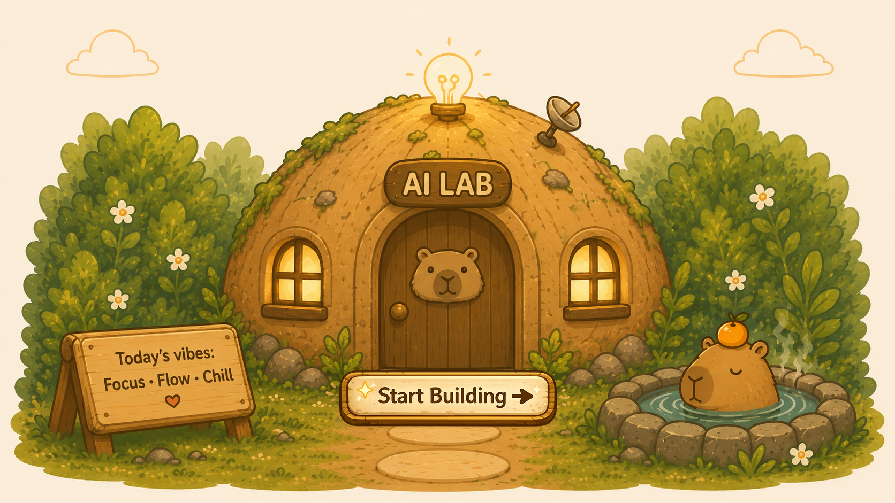

<div align="center">


# CapyHome

**The calm super-agent that actually gets things done.**

*Give it a goal. It plans, delegates to a team of Baby Capys, runs real tools in a real sandbox, and hands you the finished work.*

[Quick Start](#-quick-start) · [Modes](#-one-agent-three-gears) · [Showcase](#-see-it-in-the-wild) · [Skills](#-skills) · [FAQ](#-faq)

`Python 3.12` · `LangGraph 1.0` · `Next.js 16` · `MIT Licensed`

</div>

---

## Why CapyHome?

Most "AI agents" are a single chat loop with a few tools bolted on. CapyHome is the whole workshop.

It's an open-source **super-agent harness**: a lead agent that breaks a goal into a plan, spins up parallel sub-agents to work in isolation, runs code and tools inside a sandboxed filesystem, remembers what matters across sessions, and learns new tricks through composable **skills** — all behind a cozy Next.js workspace where you can actually watch it think.

And it isn't a coding-only tool. People use CapyHome to build slide decks, model spreadsheets, research a legal question, plan a trip, draft a podcast, analyse a dataset, or clear the week's admin. The capybara is famously the animal everything else gets along with — that's the idea. Calm on the surface, a coordinated team underneath.

**What sets it apart:**

- 🧠 **Bring your own brain.** OpenAI, Anthropic, Gemini, DeepSeek — or run *fully local* with llama.cpp. Mix and match per task.
- 🔒 **Local-first by design.** A complete research stack (SearXNG + Onyx + crawl4ai) runs on your machine. No data leaves unless you send it.
- 📂 **Mount your real folders.** Point CapyHome at a directory and it reads and writes your actual files — drive the whole flow with quick `/` slash commands.
- 🐹 **A real team, not one bot.** The lead agent delegates to parallel "Baby Capy" sub-agents, each with its own scoped context and tools.
- 🧩 **Skills, not hardcoding.** 20+ capability modules load progressively — only when the task needs them, so context stays lean.

<div align="center">

</div>

---

## 🐹 See It in Action

Tell CapyHome what you want in plain words. Here's what that looks like:

> 📈 **"Forecast the 2026 agent trends for me."**
> A pack of Baby Capys fan out across the web, gather the sources, and hand back a styled report — charts and all.

> 🚢 **"Dig into this Titanic dataset."**
> It explores the data, figures out what actually drove survival, and draws you the charts to prove it.

> 📊 **"Make sense of this codebase."**
> Mount a folder, and CapyHome reads through the whole repo — then explains how it fits together.


---

## 🎯 Two Moods: Work & Plan

CapyHome matches how hard it thinks to how hard your task is. Flip between two moods with a single click — one rolls up its sleeves, the other takes a breath and maps everything out first.

<table>
<tr>
<td width="50%" valign="top" align="center">

### 🛠️ Work Mode


*Heads down, getting it done.*

CapyHome gets a full sandbox, the complete toolset, and up to **3 parallel Baby Capys** working at once. Perfect for decks, reports, spreadsheets, code, and analysis you can actually use.

</td>
<td width="50%" valign="top" align="center">

### 🗺️ Plan Mode


*Floats, thinks, then acts.*

For the big, fuzzy goals. A full agentic **Planner → Generator → Evaluator** loop maps the work as a to-do graph, executes it step by step, checks its own output, and writes a `plan.md` you can follow along with.

</td>
</tr>
</table>

---

## 📂 Mount a Folder. Drive with Slash Commands.

Point CapyHome at a real directory on your machine and it works on your **actual files** — analyse a repo, edit a document set, refactor a project. Steer the whole flow from the chat box with `/` commands.
```
/mount         Pick a local folder → mounted into the sandbox at /mnt/user-data/mounted
/analyse       Mirror docs + build analysis artifacts (no writes to mounted files)
/publishdocs   Publish reviewed docs back to the mounted folder
/handoff       Package a structured handoff and fork the thread
/compact       Force deterministic context compaction
/new           Start a fresh chat in this workspace
```

Safe by default: `/analyse` stages work in `.docs`/`.analyse` first, and only `/publishdocs` writes results back to your folder — so the agent never touches your files until you say so.

---

## 🚀 Quick Start

```bash
git clone https://github.com/CapyHome/CapyHome.git
cd CapyHome
make config
```

Edit `config.yaml` and define at least one model:

```yaml
models:
  - name: gpt-4
    display_name: GPT-4
    use: langchain_openai:ChatOpenAI
    model: gpt-4
    api_key: $OPENAI_API_KEY
    max_tokens: 4096
    temperature: 0.7
```

Drop your keys in `.env`:

```bash
OPENAI_API_KEY=your-key
```

### 🐳 Docker (recommended)

```bash
make docker-init     # Pull sandbox image (first time only)
make docker-start    # Start everything
```

→ Open **http://localhost:2026**

### 💻 Local development

```bash
make check           # Verify Node.js 22+, pnpm, uv, nginx
make install         # Install all dependencies
make dev             # All services, hot-reload
```

→ Open **http://localhost:2026**

### 🔍 Fully local research stack

Want zero cloud dependencies? Spin up SearXNG + Onyx + crawl4ai locally:

```bash
make local-stack-start
make local-stack-status
```

---

## 🧠 How It Works

The short version: you give CapyHome a goal, a **lead agent** breaks it into a plan, hands the pieces to a team of **Baby Capys** that work in parallel, and everything runs safely inside a sandbox with its own memory and tools. That's all you need to know to start.

<details>
<summary><b>🔧 Peek under the hood (for the curious & developers)</b></summary>

<br />

```
                         Nginx (2026)
                     Reverse Proxy / Unified Entry
                    /            |             \
          LangGraph (2024)   Gateway (8001)   Frontend (3000)
          Agent Runtime      REST API          Next.js UI
               |                |
        Middleware Registry   17 Route Modules
               |
          Lead Agent (LLM)
         /      |       \
    Sandbox   MCP     Baby Capys
    Tools    Tools    (parallel sub-agents)
```

| Layer | Stack |
|---|---|
| **Backend** | Python 3.12, LangGraph 1.0.6, LangChain, FastAPI |
| **Frontend** | Next.js 16, React 19, TypeScript 5.8, Tailwind CSS 4 |
| **LLMs** | OpenAI, Anthropic, Google Gemini, DeepSeek, local llama.cpp |
| **Infrastructure** | Docker, Kubernetes, Nginx, GitHub Actions |
| **Channels** | Slack, Telegram |

### Sub-agent delegation

The lead agent spawns Baby Capys to work in parallel. Each gets its own scoped context, tools, and termination conditions — they can't see each other's state, which keeps reasoning clean and tokens cheap.

- Up to 3 concurrent sub-agents per turn, 15-minute timeout each
- Built-in delegates: `general-purpose`, `bash`
- Research delegates (`source-researcher`, `comparison-dimension-researcher`) get a 25-turn budget for deep evidence-gathering
- The activity timeline labels each live delegate (`Baby Capy — {type} …`) so you can trace exactly who did what

### Sandboxed execution

Every task runs in an isolated filesystem:

```
/mnt/user-data/
  uploads/       # Your files
  workspace/     # Agent working directory
  outputs/       # Final deliverables
  mounted/       # Folders you mount with /mount
```

Three modes — **Local**, **Docker**, **Kubernetes** — via a pluggable provisioner.

### Persistent memory

LLM-powered fact extraction across sessions, stored locally in `.capyhome/memory.json`. Only *relevant* facts are injected into the prompt; the rest stay quiet.

- Configurable confidence threshold (default 0.7), max 100 facts, debounced updates
- Redact / forget / clear operations also purge the local vector index
- Append-only versioning with auditable redaction

### MCP integration

Extend the toolset with any MCP server — lazy-loaded on first use, with OAuth (`client_credentials`, `refresh_token`) and stdio / SSE / HTTP transports.

### Context engineering

The load-bearing details that keep long runs coherent:

- **Automatic summarization** at configurable token limits
- **Planner fast paths** so obvious requests skip the planning LLM
- **Web-search circuit breaker** — repeated failed searches stop burning timeouts and trigger a fallback
- **Hooks + retries** — `SessionStart` / `PreToolUse` / `PostToolUse` / `FileChanged` hooks and per-tool retry policy
- **Resumable runs** — pick up paused or interrupted runs via the Gateway API
- **Trajectory replay** — JSONL trajectories replay-checked against eval fixtures

</details>

---

## 🧩 Skills

Skills are composable capability modules — Markdown + YAML frontmatter that teach the agent a workflow and its best practices. They load *progressively*, only when a task calls for them, so the agent stays sharp.

| Category | Skills |
|---|---|
| **Research** | deep-research, github-deep-research, find-skills |
| **Generation** | ppt-generation, podcast-generation, video-generation, pdf-pro |
| **Data** | data-analysis, excel-modeling, chart-visualization, consulting-analysis |
| **Design** | frontend-design, web-design-guidelines, bootstrap |
| **Workflow** | batch-workflow, dreamy-workflow |
| **Meta** | skill-creator, knowledge-vault, surprise-me |

Write your own in `skills/custom/` (gitignored), or let the `skill-creator` skill scaffold one for you.

---


## ⚙️ Configuration

| File | Purpose |
|------|---------|
| `config.yaml` | Models, tools, sandbox, memory, channels, summarization, planner/evaluator, hooks, retries, resume, knowledge controls, and more |
| `extensions_config.json` | MCP servers, skill enable/disable |
| `.env` | API keys, endpoints, feature flags |

Generated from examples via `make config`. See [`config.example.yaml`](./config.example.yaml) for the full set of knobs.

---

## ❓ FAQ

<details>
<summary><b>What can CapyHome actually do?</b></summary>

It's a general-purpose super agent — not a coding-only tool. People use it for deep research, slide decks, Excel models, data analysis, podcasts and videos, document work, and everyday admin. If a task can be broken into steps and tools, CapyHome can take a run at it.
</details>

<details>
<summary><b>Which language models does it support?</b></summary>

Bring your own. OpenAI, Anthropic, Google Gemini and DeepSeek work out of the box, and you can run fully local with llama.cpp. Define models in `config.yaml` and mix providers per task.
</details>

<details>
<summary><b>Is my data private?</b></summary>

It can be entirely local. CapyHome is self-hosted under the MIT license and ships a local research stack (SearXNG + Onyx + crawl4ai). Nothing leaves your machine unless you point it at a cloud model or service.
</details>

<details>
<summary><b>What does mounting a folder do?</b></summary>

`/mount` opens a native folder picker and mounts that directory into the sandbox at `/mnt/user-data/mounted`. The agent can then read and write your real files, with staging commands (`/analyse`, `/publishdocs`) to keep things safe.
</details>

<details>
<summary><b>What's the difference between Normal, Work and Plan mode?</b></summary>

Normal is fast and direct. Work gives the agent a full sandbox, tools and parallel sub-agents to produce real deliverables. Plan runs a full agentic Planner → Generator → Evaluator loop with a live DAG todo list for multi-step or ambiguous goals.
</details>

<details>
<summary><b>How do I extend it?</b></summary>

Write your own Skills (Markdown + YAML) in `skills/custom/`, plug in MCP servers via `extensions_config.json`, or swap built-in tools. The `skill-creator` skill can scaffold new skills for you.
</details>

---

## 🛠️ Development

```bash
make dev             # Start all services (hot-reload)
make stop            # Stop all services

# Backend (from backend/)
make test            # pytest
make lint            # Ruff lint
make format          # Ruff format

# Frontend (from frontend/)
pnpm check           # Lint + typecheck
pnpm dev             # Turbopack dev server
```

---

## 🤝 Contributing

We'd love the help — see [CONTRIBUTING.md](CONTRIBUTING.md) for setup, workflow, and guidelines.

## 📄 License

[MIT](./LICENSE) — build whatever you want.

<div align="center">


*Made with a calm mind and a lot of Baby Capys.* 


</div>
