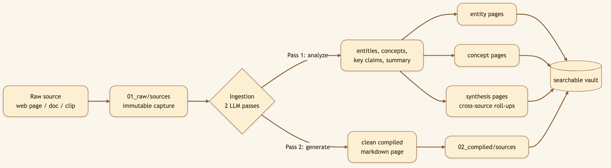
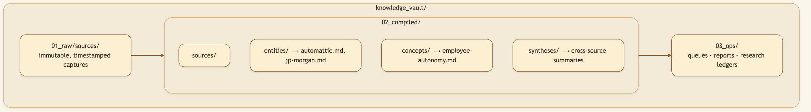
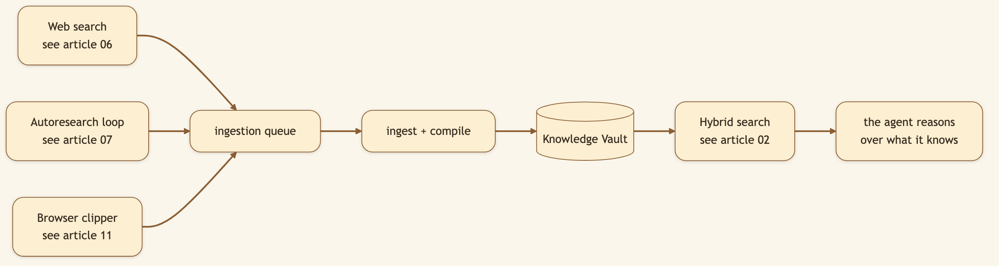

# Built a Memory That Compounds 

> **LinkedIn hook (use as the post's first line):** "We built a memory that *compounds* instead — organized around things and ideas, not chat logs."
> **Audience:** LinkedIn → Medium. Engineers, researchers, founders, and knowledge workers tired of re-doing research.

---

Most AI tools perform web search, remember bits and pieces, and maybe generate an impressive report for the afternoon. By morning, the work is gone. Ask the same question next week and the tool does the same research twice — and the webpage it relied on may already have changed or disappeared.

CapyHome's **Knowledge Vault** is built on the opposite bet: that the value of an agent grows with what it can preserve from useful sources — and that durable knowledge should be organized the way *you* think, around **things** (entities) and **ideas** (concepts), not around transcripts of who said what.

> 🖼️ **[Generate: Split-panel illustration using the character from `asset/CapyHome/capybara-logo.webp` as the base. Left panel labelled "What everyone else stores": a cute cartoon capybara (warm brown fur, rounded body) looking overwhelmed at a messy pile of overlapping chat bubbles and duplicate sticky notes. Right panel labelled "What CapyHome stores": the same capybara smiling at a clean grid of rounded entity/concept cards — each card shows a small icon, a bold title, and a purple category chip. Warm cream background, no real UI screenshot — fully illustrated.]**

## Entities and concepts, not conversations

Here's the core design decision. The vault doesn't file knowledge under "the chat where we talked about X." It files it under two kinds of pages:

- **Entities** — real-world things: people, companies, products, places (`automattic`, `jp-morgan`).
- **Concepts** — ideas and topics (`employee-autonomy`, `retrieval-augmented-generation`).

Every source the agent reads gets tagged with the entities and concepts it touches, and those tags roll *up* into pages that aggregate everything known about that thing — across every session. The result looks less like a chat app and more like a personal Wikipedia that writes itself.

Important distinction: the vault is not a dump of memory files or chat logs. Normal conversation memory lives elsewhere. The vault learns from web results, browser clips, and explicitly saved research artifacts — the material you would actually want to search later.

### Diagram 1 — How a single source becomes structured knowledge



### Diagram 2 — The three-layer vault on disk



## It plugs straight into web search

Turn on the search-to-vault pipeline and **eligible enriched web results are auto-queued for ingestion.** In practice, that means results with a URL and extracted markdown content. Empty rows are skipped, duplicates are deduped by URL/content hash, and trusted sources become durable vault pages. Research deposits into the vault as a side effect of doing the work — the library grows while you're busy with something else, and the next related question starts from what you already found.

### Diagram 3 — Knowledge flows in from three on-ramps



> 🖼️ **[Generate: Illustration using the character from `asset/CapyHome/capybara-logo.webp` as the base. A cute cartoon capybara sits at a laptop. Above the capybara's head, a large thought bubble shows a two-panel vault explorer: the left side is a tree of entity and concept names with folder icons; the right side shows an open compiled page with titled sections and a short paragraph. The capybara points at the thought bubble with one paw, looking curious and pleased. Stacks of books sit beside the desk to evoke depth of knowledge. Warm cream background, fully illustrated.]**

## Under the hood: how it's built

The implementation is where the durability comes from. A few decisions worth calling out:

- **Two LLM passes per source.** `_analyze_source` (prompt: `ANALYZE_SOURCE_PROMPT`) extracts entities, concepts, topic tags, a summary, key claims, open questions, gap queries, and synthesis references; `_generate_source_sections` (prompt: `GENERATE_PAGE_PROMPT`) writes the clean compiled page. A heuristic fallback runs if chain-of-thought ingest is disabled or the content is too short.
- **Entity and concept extraction is source-grounded.** Entities are proper-noun-like things the source is substantively about: people, organizations, products, places, named techniques, events, or artifacts. Concepts are recurring ideas, frameworks, or themes. The extractor is strict because noisy entities poison retrieval; when uncertain, the prompt tells the model to use concepts or omit the item.
- **Autoresearch is the deeper question loop.** Normal vault ingest analyzes each source and records open questions/gap queries. The separate autoresearch loop uses a 12-cluster question taxonomy to anticipate what a curious human might ask next, dispatches focused researchers, and saves those answers back into the vault.
- **Crash-safe, parallel ingestion.** Ingestion runs in phases. *Phase 0* rescues orphaned work — `requeue_all_claimed_items()` returns items whose 15-minute worker **lease** expired (i.e. a crashed worker), and `cleanup_orphan_compiled_files()` prunes pages unreachable from the manifest. *Phase 1* drains the queue with parallel workers that claim items in batches of 100 (work-stealing). *Phase 2* reprocesses any source missing reference pages. The manifest is saved periodically so a mid-run crash loses almost nothing.
- **Hybrid search, not vector-only search.** The query tool searches compiled vault pages with keyword/BM25 matching, then fuses those results with vector hits when vector indexing is enabled and embeddings are available. `VaultVectorIndex` chunks compiled markdown pages, calls an OpenAI-compatible `/embeddings` endpoint, and stores a local file-backed index in `.vault_state/vector_index.json` + `.vault_state/vector_index.npz` — not a remote vector database.
- **A trust gate** (`min_trust_score`, default 0.55) keeps weak sources out, and **lint/prune** garbage-collects orphaned or low-value pages, with a dry-run mode that shows what it *would* remove first.
- **Entity dismissal + aliasing** collapse duplicates (`JPM` → `jp-morgan`) into one canonical page; an **entity browser** surfaces your most-covered entities and your coverage gaps.

Key files: `backend/src/control_plane/vault_learning/_ingest.py`, `_lint.py`, `_entities.py`; API in `backend/src/gateway/routers/vault.py`.

## What was considered (and the trade-offs we made)

- **Why a knowledge graph, but stored as markdown files?** We wanted the structure of a graph (entities, concepts, links) without locking knowledge inside a database you can't read or grep. Plain markdown on disk means the vault is inspectable, portable, diff-able, and yours. The trade-off: we maintain a manifest + sidecar index to keep lookups fast, instead of getting that for free from a DB.
- **Why hybrid keyword + vector search?** Keyword search is precise when you remember the words. Vector search helps when you remember the meaning. Fusing both makes the vault useful as a cached web-search backbone: exact terms still matter, but recall does not collapse when you ask the question differently.
- **Why let lint *delete* pages?** A library that only grows eventually becomes noise. We chose aggressive, LLM-judged pruning (with a dry-run safety net and kill switches) over a tidy-but-useless archive. Destructive by design, reversible by choice.
- **Why entity *and* concept layers, not just tags?** Flat tags don't aggregate. Two first-class page types let "everything about JP Morgan" and "everything about employee autonomy" each have a home that updates itself.

## 🎬 Video script (YouTube Short — ~30s, vertical 9:16)

> **Format:** vertical 1080×1920, hard hook in the first 2s, fast jump cuts. Screen recordings sped up 1.5×, captions burned in (most Shorts play muted).
>
> **[0:00–0:03] Hook — AI-generated b-roll:** a robot/face having its memory wiped, text slams in: *"Every AI forgets you. This one doesn't."*
>
> **[0:03–0:12] Screen — run a research task (sped up 1.5×):** "I asked CapyHome to research a company." *(agent searches, works.)* Caption: *"Watch what it does on the side."*
>
> **[0:12–0:22] Screen — vault explorer (fast jump cuts, quick zoom):** "It filed everything into a vault — by entity and concept." *(snap through the company page + 2 concept pages, no slow pans.)*
>
> **[0:22–0:28] Screen — new session:** "New chat. I ask a follow-up." *(instant answer, citing the vault.)* Caption: *"It already knew."*
>
> **[0:28–0:30] End card — AI-generated or static:** *"Open source 👇"* + repo URL.

### Producing it with ComfyUI

ComfyUI can't render your actual UI — the screen segments are real screen recordings (OBS / QuickTime). Use ComfyUI for the **hook b-roll** ([0:00–0:03]) and the **end card** ([0:28–0:30]), then edit everything together in CapCut / Resolve / ffmpeg.

- **No model generates 30s in one pass** — they top out at ~5s. Stitch short clips: generate one, take its **last frame**, feed it as the init image (i2v) for the next, concat. Or generate independent clips and hard-cut them.
- **Model picks (early 2026):** *Wan 2.2* (~5s, highest quality) or *LTX-Video* (faster, lighter, longer clips) for the hook; *SVD* if you're animating a still you already have. Add a *RIFE/FILM* interpolation node to smooth to 24–30fps.
- **Export 9:16** (e.g. 832×1216 → upscale) so the b-roll matches the vertical frame without cropping.

> 🖼️ **[Generate: 9:16 vertical illustration end card using the character from `asset/CapyHome/capybara-logo.webp` as the base. A cute cartoon capybara holds its head with both paws, eyes wide and swirling (memory-wipe visual). Above its head, a large thought bubble shows a glowing brain icon with an eraser wiping it clean — dust particles flying off. Bold caption at the bottom: "No memory? No problem." Warm cream background, vertical 1080×1920 crop.]**

## Try it

> **Run a deep-research task, then open the vault explorer. Watch entity and concept pages appear. Ask a follow-up the next day — it won't start from zero.**

```bash
git clone https://github.com/CapyHome/CapyHome.git && cd CapyHome && make config && make docker-start
```

---

*Next: [Hybrid Vault Search →](./02-hybrid-vault-search.md) — finding the right page even when you forget the right words.*
