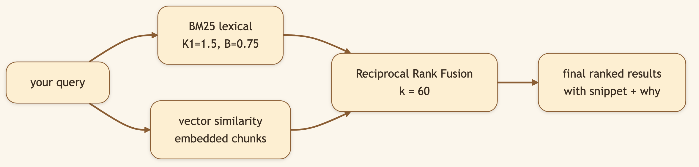
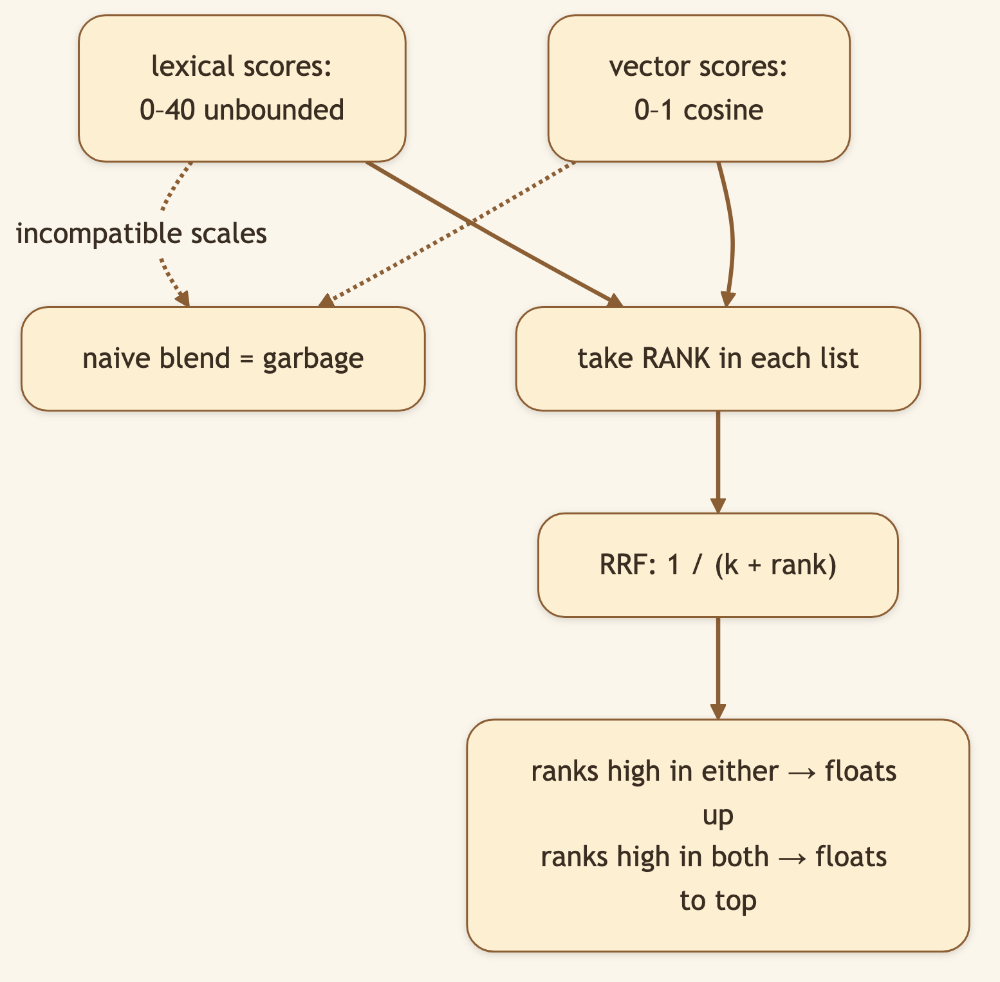
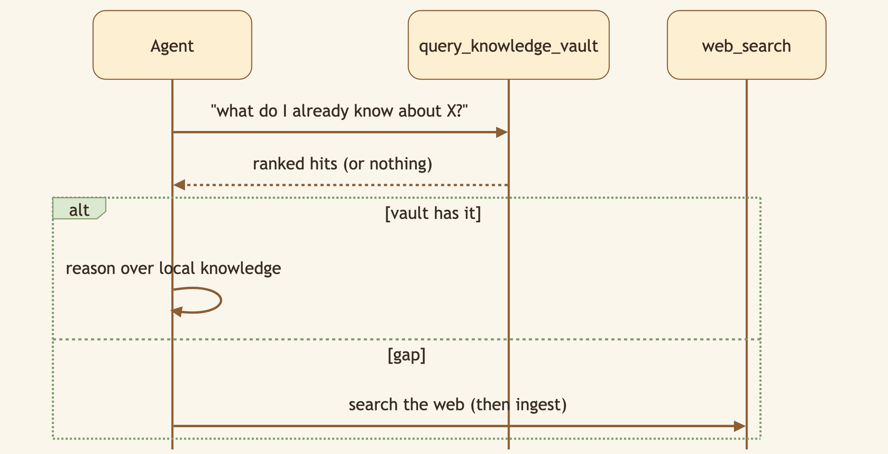

# Your Notes Are Useless If You Can't Find Them. This Search Reads Your Mind.

> **LinkedIn hook (use as the post's first line):** "A knowledge base you can't search is just a graveyard. We combined keyword search and semantic search — and fused them — so recall doesn't depend on remembering the exact words."
> **Audience:** LinkedIn → Medium. Search/RAG engineers, researchers, anyone building a second brain.

---

A library is only as good as your ability to find the right book six months later — when you've forgotten exactly how you phrased things. That's the moment most knowledge bases fail you. CapyHome's vault search is built for *that* moment.

> 🖼️ **[Generate: Illustration using the character from `asset/CapyHome/capybara-logo.webp` as the base. A cute cartoon capybara sits at a laptop holding a magnifying glass. Above the capybara's head, a large thought bubble shows a search bar with the typed query "staff freedom" and a single highlighted result card beneath it titled "Employee Autonomy" with a green match badge. A small speech arrow from the result reads "different words, right answer." Warm cream background, fully illustrated — no real UI screenshot.]**

## Two kinds of search, and why you want both

- **Keyword (lexical) search** is fast and precise when you know the term — but brittle. Search "staff freedom" and it misses a page titled "employee autonomy."
- **Semantic (vector) search** understands meaning — but drifts toward vibes when you wanted an exact term.

CapyHome runs **both** and merges them, so you get exact-term precision *and* meaning-based recall in one ranked list.

### Diagram 1 — The two lanes, then fusion

### Diagram 2 — Why fuse by rank, not by score

## Under the hood: how it's built

**Lexical layer.** Every compiled page is tokenized and scored with **BM25** — the battle-tested ranking function behind classic search engines. Always on, always fast, no model required.

**Vector layer (optional).** When enabled, pages are split into overlapping chunks (default **1200 chars, 200 overlap**) and embedded — via an OpenAI-compatible `/embeddings` endpoint, or a deterministic **hash-based fallback** if you'd rather make zero external calls. The query is embedded the same way and matched by similarity.

**Fusion.** Instead of forcing two incompatible score scales to agree, CapyHome uses **Reciprocal Rank Fusion** (`hybrid_rrf_k = 60`) — blending by *rank*, which is robust and needs no fragile normalization.

Every result returns a fused score, its category (source / entity / concept / synthesis / query), a snippet centered on the best-matching token, and — in hybrid mode — the individual lexical and vector ranks so you can see *why* it surfaced. Implementation: `backend/src/control_plane/services/unified_vault_search.py`.

### Diagram 3 — The agent searches before it reaches for the web

> 🖼️ **[Generate: Illustration using the character from `asset/CapyHome/capybara-logo.webp` as the base. A cute cartoon capybara peers at a laptop screen, looking pleased. The illustrated screen shows a vault search results list: three result cards, each with a bold relevance score badge (e.g. "0.91"), two small purple category chips (e.g. "entity", "concept"), and a one-line snippet of text. The capybara points at the top result with one paw. Warm cream background, fully illustrated.]**

## What we considered (and the trade-offs we made)

- **Why RRF over weighted score blending?** Weighted blends require normalizing two unrelated score distributions — fragile, and it breaks the moment your corpus shifts. Rank fusion sidesteps the whole problem. The trade-off: we throw away some score *magnitude* information, but gain robustness we never have to tune.
- **Why is vector search OFF by default?** Because BM25 alone is genuinely good for most libraries, and "semantic search" shouldn't mean "mandatory embedding bill." We made the powerful option opt-in and gave it a no-network fallback.
- **Why a hash-based embedding fallback?** Some users can't or won't call an embeddings API. A deterministic hash embedding gives semantic-*style* behavior with zero external calls — strictly worse than a real model, but strictly better than nothing, and fully private.
- **Why chunk at 1200/200?** Small enough to keep a hit focused on the relevant passage, with enough overlap that meaning isn't severed at a boundary. Both are config knobs if your corpus wants otherwise.

## 🎬 Video script (45–60s screen recording)

> **[0:00–0:08] Hook:** "Here's the test every knowledge base fails: can you find something when you've forgotten the exact words?"
>
> **[0:08–0:25] Screen:** "I researched this topic months ago and called it 'employee autonomy.' Today I search for 'staff freedom' — totally different words." *(type it.)*
>
> **[0:25–0:40] Screen — results appear:** "There it is, top result. That's keyword search and semantic search fused together. Keyword nails the exact terms; semantic catches the meaning."
>
> **[0:40–0:55] Close:** "It's all local — you can even run the semantic layer with zero external calls. Open source, link below."

## Try it

> **Search your vault using *different words* than you originally researched with. The right page still comes back.**

---

*Next: [Plan Mode & Work Mode →](./03-plan-and-work-mode.md) — how CapyHome decides to think before it acts.*
