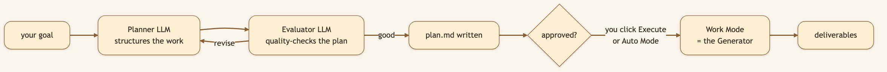
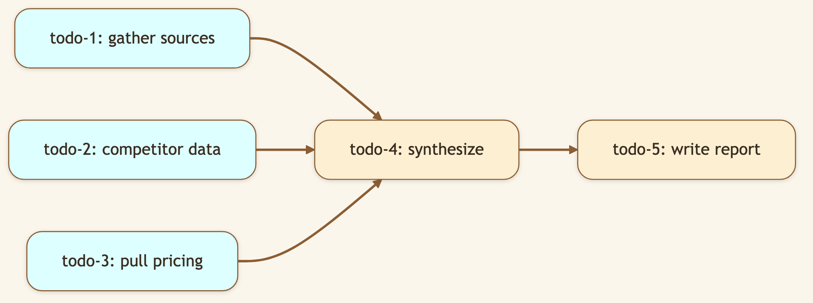
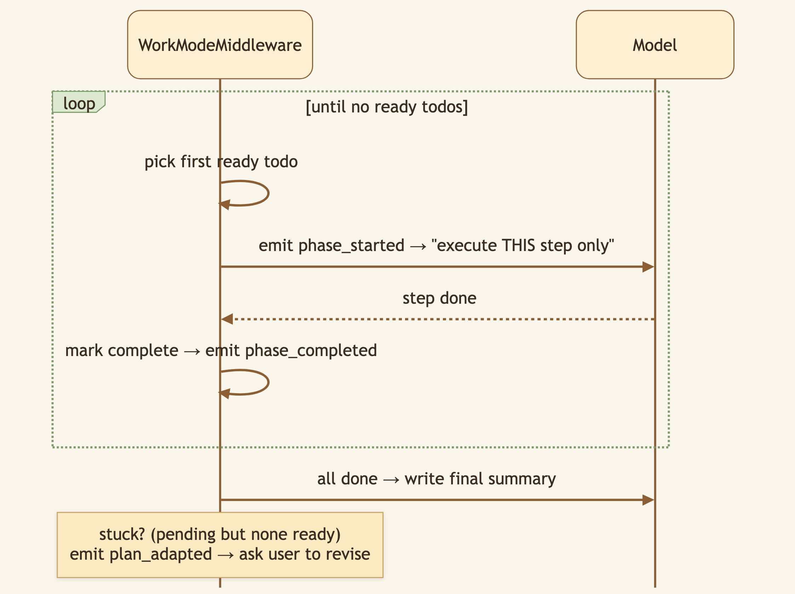

# The Difference Between a Junior and a Senior AI Agent? One Plans First.

> **LinkedIn hook (use as the post's first line):** "The difference between a junior and a senior isn't speed — it's that the senior pauses, maps the work, then starts. We taught our AI agent that instinct."
> **Audience:** LinkedIn → Medium. Eng leaders, agent builders, anyone burned by an AI that charges off in the wrong direction.

---

Hand a vague goal to a typical AI agent and it charges off immediately, improvising — and you discover three steps in that it misunderstood the whole thing. CapyHome bakes in a senior's instinct with two distinct gears: a **Plan Mode** that maps the work first, and a **Work Mode** that executes it.

> 🖼️ **[Generate: Split-panel illustration using the character from `asset/CapyHome/capybara-logo.webp` as the base. Left panel: a cartoon capybara wearing a tiny hard hat and holding a small wrench, sitting at a laptop with a glowing "🛠️ Work" chip in the illustrated toolbar — labelled "Get it done." Right panel: the same capybara holding a small map scroll, sitting at a laptop with a glowing "🗺️ Plan" chip — labelled "Think first." Warm cream background, subtle dividing line between panels.]**

## One agent, two gears

- **🛠️ Work Mode** — heads down. Full toolset, full sandbox, up to three parallel sub-agents. For tasks where the path is clear.
- **🗺️ Plan Mode** — floats above the task, thinks, and writes a plan *before* touching anything. For the big, fuzzy goals where the hard part is figuring out *what* to do.

Plan Mode is a deliberate choice you make — there's no surprise auto-escalation mid-task.

### Diagram 1 — The Planner → Generator → Evaluator loop

While planning, Plan Mode is deliberately **declawed** — read-only tools plus web search for *scope discovery only*. A runtime gate (`PlanExecutionGateMiddleware`) physically blocks it from writing files or running code, so the planning phase stays a planning phase.

### Diagram 2 — Todos are a DAG, not a checklist

todo-1/-2/-3 have no dependencies — so they're **ready** and can fan out to [Baby Capy sub-agents](./08-baby-capy-subagents.md) *in parallel*. todo-4 waits for its inputs. The system recomputes "ready" at every step.

### Diagram 3 — Work Mode's phase loop

> 🖼️ **[Generate: Illustration using the character from `asset/CapyHome/capybara-logo.webp` as the base. A cute cartoon capybara sits at a laptop, watching attentively with one paw raised. The illustrated laptop screen shows a vertical phase checklist: two items with green checkmarks (✓), one item highlighted in soft blue with a small spinning circle and the label "In Progress", and two items below greyed out as pending. Warm cream background, fully illustrated — no real UI screenshot.]**

## A plan you can read — and edit

Plan Mode writes a real file: **`plan.md`** in the workspace (canonical `plan_version: 6`), with a YAML header — objective, assumptions, risks, acceptance criteria, the full todo graph — and a human-readable body. It's versioned on every revision. Because it's a file, you can **edit it before approving**; at handoff, CapyHome re-reads it from disk and honors your edits. The plan is a contract, not a black box.

## Under the hood: how it's built

- **Two separate LangGraph graphs.** `plan_agent` and `work_agent` are distinct, with distinct tool catalogs — `internal_tools_plan.json` (read-only surface) vs. `internal_tools_work.json` (full execution surface). Mode isn't a flag the model can ignore; it's a different graph with different tools.
- **The Planner is its own LLM call.** `PlannerMiddleware` invokes a dedicated planner with `PLANNER_SYSTEM_PROMPT`, parsing structured `PlannerOutput` JSON (title, objective, assumptions, constraints, risks, acceptance criteria, a domain classification, and the todo list with `depends_on`, `owner`, `subagent_type`, `failure_fallback`, `steps`).
- **The Evaluator catches weak plans early.** `PlanEvaluatorMiddleware` runs a fast, timeout-bounded quality check that can patch the todo graph (`add` / `modify` / `remove`) before you ever see it.
- **The DAG drives execution.** `TodoDagMiddleware` normalizes todos and computes `ready_ids` (status not done/blocked AND all `depends_on` completed). `WorkModeMiddleware` walks that, emitting `phase_started`, `phase_completed`, and — when the graph stalls — `plan_adapted`.
- **Tunables:** `planner.max_plan_steps` (default 8), `planner.max_clarifications` (5), `todos.dag_enabled`, `evaluator.plan_evaluator_timeout_seconds`.

## What we considered (and the trade-offs we made)

- **Why two graphs instead of one agent with a "planning prompt"?** A prompt that says "don't execute yet" is a suggestion an LLM can ignore. Two graphs with two tool catalogs make it structurally impossible for the planner to write files. Safety from architecture, not from politeness.
- **Why kill auto-escalation?** An earlier version auto-promoted complex Work tasks into Plan Mode. It surprised people mid-task and felt like the tool second-guessing them. We removed it: planning is now a deliberate toggle. (When a running plan *stalls*, we emit `plan_adapted` and let **you** decide to revise — we don't silently re-plan.)
- **Why a DAG over a flat todo list?** A flat list can't express "these three are independent, that one waits." The DAG is what makes safe parallelism possible — the single biggest speedup on research-style work.
- **Why write `plan.md` to disk at all?** Because a plan you can't see or edit is a black box, and black boxes erode trust. A readable, editable, versioned file makes the agent's intentions auditable and steerable.

## 🎬 Video script (75–90s screen recording)

> **Title card:** "I gave my AI a vague goal. Watch it plan before it acts."
>
> **[0:00–0:10] Hook:** "Most AI agents charge off and improvise. Then you find out three steps in they misunderstood the whole thing. Here's a different approach."
>
> **[0:10–0:25] Screen — type a fuzzy goal, click Plan Mode:** "I'll give it something genuinely ambiguous, and switch to Plan Mode."
>
> **[0:25–0:45] Screen — plan.md appears:** "Instead of doing anything, it wrote a *plan* — objective, assumptions, risks, and a dependency graph of steps. And it's a file I can edit." *(tweak one step.)*
>
> **[0:45–1:05] Screen — click Execute, phases run:** "Now I approve it. Work Mode takes over and executes step by step — and these independent steps run in *parallel*." *(point at multiple phases.)*
>
> **[1:05–1:25] Close:** "Plan first, then execute — the difference between a junior and a senior. Open source, link below."

## Try it

> **Take a genuinely ambiguous goal ("help me decide which framework to standardize on"), click Plan Mode, watch `plan.md` get written, tweak a step, then hit Execute.**

---

*Next: [Auto Mode →](./04-auto-mode.md) — for when you trust the plan and just want it to run.*
