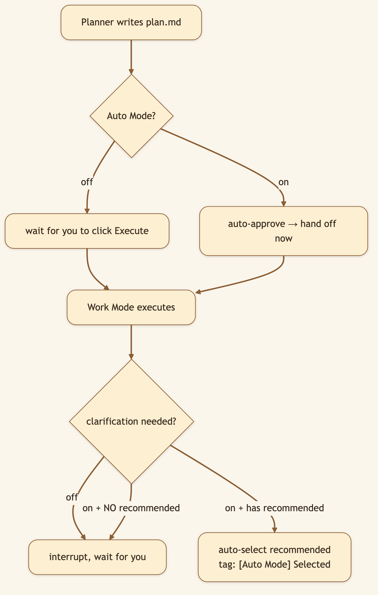
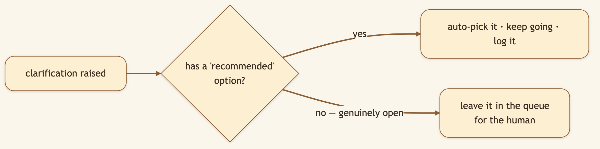

# I Gave My AI a Goal and Walked Away. This Switch Made It Safe.

> **LinkedIn hook (use as the post's first line):** "Planning gives you control. Sometimes you don't want control — you want to hand off a goal, close the laptop, and come back to finished work. Here's the switch that makes that safe."
> **Audience:** LinkedIn → Medium. Busy operators, founders, anyone who wants hands-off automation without losing the audit trail.

---

Approval gates are a safety feature. They're also friction — and for tasks you trust, friction is just latency between you and the result. **Auto Mode** lets you choose, per task, where you sit on the trust-vs-control dial.

> 🖼️ **[User add: image containing — the Auto Mode toggle in the input toolbar's privacy/auto menu, switched ON. Capture from the running app.]**

## What it is (and isn't)

Auto Mode isn't a third mode. It's a **modifier on [Plan Mode](./03-plan-and-work-mode.md)** — a toggle that removes two pauses:

1. **Plan approval.** Normally you click **Execute Plan**. With Auto Mode on, an approved plan hands off to Work Mode and starts immediately.
2. **Clarification questions.** Normally the agent asks you and waits. With Auto Mode on, if a question ships with a **recommended** option, it picks it and continues — leaving a `[Auto Mode] Selected: …` marker you can audit.

What it does **not** do: make Work Mode reckless, auto-escalate simple tasks, or change execution itself. The phasing, the DAG, the evaluator, the retries — all identical. Auto Mode only removes the *waiting*.

### Diagram 1 — Where Auto Mode removes the gates

### Diagram 2 — The guardrail: it only auto-answers safe forks

This is the thoughtful part: Auto Mode doesn't flip a coin on genuinely open questions. It only auto-answers forks where the agent already has a defensible default.

> 🖼️ **[User add: image containing — a transcript snippet showing a clarification auto-resolved, with the literal "[Auto Mode] Selected: <option>" marker visible. Capture from a real auto-mode run.]**

## Under the hood: how it's built

- **A single boolean, resolved with clear precedence.** `auto_mode` lives on the thread state and the run payload. `resolve_auto_mode()` (REST path) and `_auto_mode_enabled()` (live agent loop) both follow the same order: explicit request override → thread state → `False`.
- **Auto-approval on creation.** In `PlannerMiddleware`, `plan_status = "approved" if auto_mode and not clarification_pending else "draft"`, and the SSE event is tagged `plan_auto_approved` instead of `plan_created`.
- **Auto-selection of clarifications.** `ClarificationMiddleware` caches the flag on the runtime context (so the async tool-call wrapper can read it) and, when a recommended option exists, returns a `Command` that records the answer with the `[Auto Mode] Selected:` prefix.
- **Daemon handoff.** When the last clarification is answered under Auto Mode, `spawn_work_mode_handoff()` fires the Work Mode run on a daemon thread — re-reading `plan.md` from disk first so any edits are honored.

Everything is fully auditable after the fact: every auto-decision is stamped in the transcript and the plan carries an `approved_at` timestamp.

## What we considered (and the trade-offs we made)

- **Why gate auto-answers on a "recommended" option?** The naive version auto-answers *everything*, which means it guesses on questions that genuinely needed you. By only auto-selecting forks that ship a recommendation, we kept autonomy where it's safe and a pause where it isn't.
- **Why not a global "always auto" setting?** Trust is per-task, not per-account. A toggle in the input box lets you decide fresh each time — hands-off for the overnight research run, hands-on for the irreversible thing.
- **Why leave such loud audit markers?** Because "the AI decided something on my behalf" is exactly the moment you want a paper trail. `[Auto Mode] Selected:` and `plan_auto_approved` make every autonomous decision greppable.
- **Why keep a handoff step at all instead of one seamless run?** Re-reading `plan.md` at handoff is the seam that lets your between-approval edits take effect. A little ceremony buys a lot of steerability.

## 🎬 Video script (45–60s screen recording)

> **[0:00–0:10] Hook:** "I wanted to give my AI a research goal and just… walk away. But I didn't want it guessing on the important stuff. Here's how that works."
>
> **[0:10–0:25] Screen — enable Plan + Auto Mode, submit a goal:** "Plan Mode on, Auto Mode on. I submit, and I close the laptop."
>
> **[0:25–0:45] Screen — come back, scroll the transcript:** "It planned, approved itself, and ran. And here — it hit a fork, took the recommended option, and *logged exactly what it chose*. The genuinely open questions? It left those for me."
>
> **[0:45–0:55] Close:** "Autonomy where it's safe, a pause where it isn't. Fully auditable. Open source, link below."

## Try it

> **Enable both Plan Mode and Auto Mode, submit a research goal, and walk away. Come back to finished deliverables and a full record of every decision it made.**

---

*Next: [Mount a Folder, Drive with Slash Commands →](./05-slash-commands-mount-analyse.md).*
