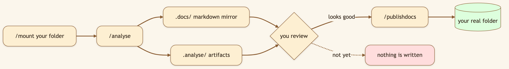

# Stop Uploading Files to the Cloud. Point Your AI at a Real Folder.

> **LinkedIn hook (use as the post's first line):** "Cloud AI tools make you upload your files into their sandbox, one at a time. We flipped it: point the AI at a real folder on your machine — and it never touches your files until you say so."
> **Audience:** LinkedIn → Medium. Developers, consultants, lawyers, analysts — anyone whose real work lives in local folders they can't upload.

---

The chat box is a command line. Type `/` in the workspace and the verbs you need are one slash away — no buttons to hunt for, no settings panes.

```
/mount         Pick a local folder → mounted into the sandbox
/analyse       Mirror the folder to markdown + build analysis artifacts (read-only)
/publishdocs   Publish reviewed docs back to the mounted folder
/handoff       Package a structured handoff and fork into a new thread
/compact       Force deterministic context compaction
/recover       Clear a stuck run and resume
/new           Fresh chat in this workspace
/rename        Rename the thread
```

> 🖼️ **[User add: image containing — the `/` command menu open in the input box, showing the command list. Capture from the running app by typing "/".]**

## The safety contract, in one diagram

### Diagram 1 — Stage → review → commit



The agent **cannot** sneak changes into your folder. `/analyse` only stages into scratch dirs; the *only* command that writes back is `/publishdocs`, run deliberately by you.

### Diagram 2 — How `/mount` makes your files look local to the sandbox


### Diagram 3 — What `/analyse` produces (4-stage, read-only)


> 🖼️ **[User add: image containing — a real screenshot of a generated repo_overview.md open in the workspace, showing the architecture summary + critical files. Capture after running /analyse on a project.]**

## Under the hood: how it's built

- **`/mount`** opens the *real* OS folder picker (osascript on macOS, zenity/kdialog on Linux), validates the directory, and persists its absolute path to `dreamy_mount.json`. `MountFolderMiddleware` then translates between the virtual `/mnt/user-data/mounted/*` path the agent sees and the real on-disk location, so `read_file`, `write_file`, and `bash` all just work on your actual files. (It injects a `<mounted_folder>` system note in Work Mode only — not Plan Mode.)
- **`/analyse`** runs a four-stage pipeline (router: `backend/src/gateway/routers/workspace_io.py`): mirror-to-markdown → build `.analyse` artifacts → spawn an async LLM job that writes `repo_overview.md` (architecture, key features, execution flow, risks, recommended reading order) → hand the structured map to the agent. You can poll the async job for status.
- **`/publishdocs`** is the single write-back path, gated behind the repo-overview refresh status so you don't publish over a stale analysis.

## What we considered (and the trade-offs we made)

- **Why mount a local folder instead of "upload your files"?** Because the most valuable work — proprietary code, client docs, financials — is exactly what you can't paste into someone else's cloud. Mounting keeps the data on your machine ([local-first](./10-local-first-byob.md)) while giving the agent full read/write *under your control*.
- **Why force a staging step instead of editing in place?** An agent that can edit your real project is powerful and terrifying. The `/analyse → review → /publishdocs` contract gives you the power without the terror: nothing touches your files until you commit.
- **Why convert everything to markdown first?** The agent reasons best over markdown, and a deterministic mirror means analysis is reproducible and reviewable — you can read exactly what the agent read.
- **Why a *native* folder picker?** A browser file input can't grant access to a whole directory tree the way a real OS dialog can, and it's the interaction people already trust for "pick a folder."

## 🎬 Video script (60–75s screen recording)

> **Title card:** "Stop uploading files. Point your AI at a real folder."
>
> **[0:00–0:10] Hook:** "Every cloud AI tool wants me to upload my files into their box. My real work can't leave my machine. So I mount it instead."
>
> **[0:10–0:25] Screen — type /mount, OS picker opens, choose a project:** "Slash-mount. That's my actual OS folder picker. I pick a real project."
>
> **[0:25–0:45] Screen — type /analyse:** "Slash-analyse. It mirrors everything to markdown and writes an architecture overview — a real map of the codebase. And notice: it has *not* touched my files."
>
> **[0:45–1:00] Screen — ask a question, then /publishdocs:** "Now I can ask 'how does this fit together?' and get a grounded answer. When I'm happy, *only then* does /publishdocs write results back."
>
> **[1:00–1:10] Close:** "Your files, your machine, your call. Open source, link below."

## Try it

> **`/mount` a project folder, `/analyse` it, read the generated `repo_overview.md`, then ask "how does this codebase fit together?"**

---

*Next: [Web Search That Writes Markdown →](./06-websearch-markdown.md).*
