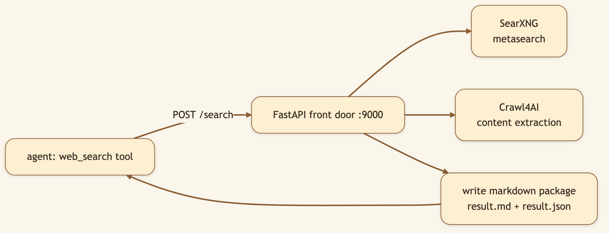
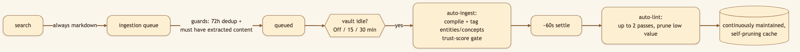
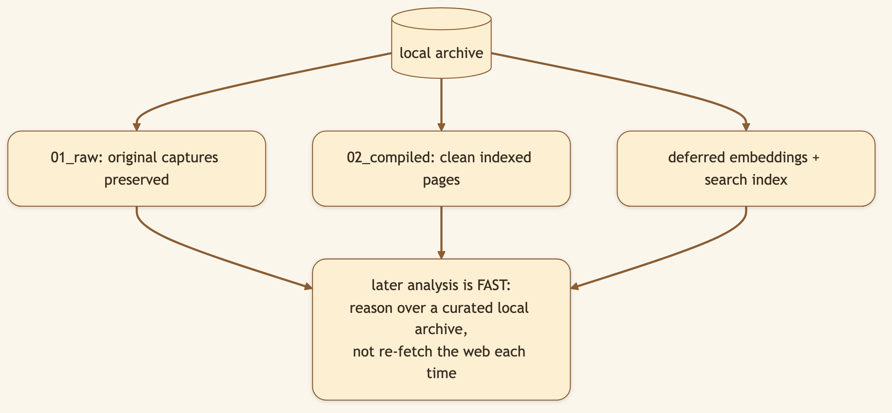

# Every Web Search My AI Runs Quietly Builds a Library

> **LinkedIn hook (use as the post's first line):** "Most agent web search is a black box — query in, answer out, knowledge gone. Ours writes clean markdown to disk every time, then quietly files it into a self-pruning library. Research stops being throwaway."
> **Audience:** LinkedIn → Medium. RAG/search engineers, researchers, knowledge-management nerds, privacy-conscious builders.

---

The throwaway nature of normal agent search is a hidden tax: every session re-discovers the same things. CapyHome treats each search as a small, permanent contribution to a growing library — and the unglamorous plumbing that makes that possible is one decision: **every search writes markdown.**

> 🖼️ **[Generate: Illustration using the character from `asset/CapyHome/capybara-logo.webp` as the base. A cute cartoon capybara sits at a laptop, looking organised and happy. The illustrated screen is split: the left side shows a file tree with timestamped folders (e.g. "2026-06-14_research/") expanding to show "result.md" and "result.json"; the right side shows an open result.md with a short paragraph and two source citation lines ending in URLs. A small globe icon floats near the file tree to evoke web retrieval. Warm cream background, fully illustrated.]**

## A search stack that runs on your machine

CapyHome's web search combines three open-source pieces behind one FastAPI door (port 9000, speaks JSON and MCP):

- **SearXNG** — privacy-respecting metasearch, no tracking.
- **Crawl4AI** — fetches and extracts the actual *content* of result pages.
- **FastAPI** — ties them together.

Run it all locally (`make local-stack-start`) and your queries never touch a commercial search API.

### Diagram 1 — The search stack

## The markdown-always design

When the agent searches, the service doesn't just return snippets — CapyHome forces `write_markdown_package = True`, so a markdown package is **always** written, alongside raw JSON, in a timestamped directory. One search yields three things: structured data for the agent, a human-readable file, and an artifact *already* in the format the next step wants.

Why markdown specifically? Because it's the **lingua franca of CapyHome's pipeline** — the [vault](./01-knowledge-vault.md) ingests markdown, the agent reasons in markdown, reports are written in markdown. No lossy conversion between "found it" and "filed it."

## A continuous, self-pruning cache of the web

Follow one search all the way through and you can see a small machine running:

### Diagram 2 — Search → queue → ingest → lint

1. **Search → markdown.** Always produced. ✅
2. **Markdown → queue**, guarded so the queue stays clean: a **72-hour dedup window** and a **must-have-extracted-content** rule (no cookie-banner junk).
3. **Queue → auto-ingestion, on idle.** No button. When the vault sits idle for a stretch *you choose* — **Off, 15, or 30 minutes** — a passive auto-run drains the queue into compiled, entity/concept-tagged pages. A trust-score gate filters weak sources here.
4. **Ingestion → auto-lint.** After a ~60s settle, an automatic lint pass (up to two passes, LLM-judged) **prunes** orphaned or low-value pages so the library stays dense.

> Both the idle auto-ingest and the auto-lint are yours to control — set the timer or switch them off entirely. Convenient by default, never running behind your back without an off switch.

### Diagram 3 — Why it's a "cache for in-depth analysis"

> 🖼️ **[Generate: Illustration using the character from `asset/CapyHome/capybara-logo.webp` as the base. A cute cartoon capybara sits at a laptop pointing at the top of the illustrated screen with one paw. In a narrow top banner of the illustrated UI, a clock icon sits next to a three-option pill selector: "Off" | "15 min" | "30 min" — the "15 min" option is selected and highlighted in purple. The capybara has a relaxed, "I'll let it run" expression. Warm cream background, fully illustrated.]**

## Under the hood: how it's built

- **Always-markdown is enforced client-side.** `backend/src/community/web_search/tools.py` sets `write_markdown_package: True` in the payload, so from CapyHome's side it's never optional. The standalone websearch service (`/Users/.../websearch`) treats it as a flag for other callers.
- **Queue guards live before ingest.** Items append only if the vault is enabled, `search_results_queue_enabled` is on, and there's readable extracted content; a 72h content-hash dedup window prevents pile-ups.
- **The idle auto-run is frontend-driven** (`frontend/.../vault/use-idle-auto-run.ts`): a 15-second poll fires `onAutoIngest()` once you've been idle past your configured threshold, then `onAutoLint()` after a settle period. (The 15-minute value *inside the backend* is something different — a worker **lease timeout** for rescuing crashed ingest jobs, not the trigger.)
- **Resilience:** a circuit breaker backs off after repeated failed searches; a semaphore bounds concurrency (default 3) so a fan-out of sub-agents doesn't stampede the service; old packages auto-prune (markdown after a day, logs after a week).

## What we considered (and the trade-offs we made)

- **Why markdown by default instead of on request?** Because "remember to save it" never happens. Making capture the default — not an extra step — is what turns a search tool into a library that fills itself.
- **Why an *idle* trigger instead of ingesting immediately?** Ingestion is LLM-heavy. Running it the instant a result lands would fight the agent for compute mid-task. Waiting for idle means the expensive work happens when you've stepped away — and you can turn it off if you'd rather control it manually.
- **Why let auto-lint *delete*?** A cache that only grows becomes noise that slows search. Aggressive pruning keeps it dense. It's destructive by design — so it ships with kill switches and a configurable cadence.
- **Why a local search stack at all?** So the privacy story is real. Pair the local stack with a [local model](./10-local-first-byob.md) and the entire research loop runs without anything leaving your machine.

## 🎬 Video script (60–75s screen recording)

> **Title card:** "Every search my AI runs builds a library."
>
> **[0:00–0:10] Hook:** "Most AI web search throws the knowledge away the second you get your answer. Watch what happens here instead."
>
> **[0:10–0:25] Screen — run a search:** "I ask it to research something. Normal answer. But look in the files — it wrote a clean markdown package of every result. On disk. Forever, if I want."
>
> **[0:25–0:50] Screen — show the vault filling, idle clock:** "And it doesn't stop there. When I step away, it quietly ingests those results into a knowledge vault — then *prunes* the junk. This clock controls when. I can set it to 15 minutes, 30, or off."
>
> **[0:50–1:05] Screen — search the vault:** "Now next week's research starts from what I already found, not from zero."
>
> **[1:05–1:15] Close:** "Throwaway search is a tax. This is a library that fills itself. Open source, link below."

## Try it

> **Ask CapyHome to research something, then open the workspace files — the markdown packages are sitting there. Leave it idle and watch them flow into the vault.**

---

*Next: [The Autoresearch Loop →](./07-autoresearch-loop.md) — what happens when research drives itself.*
