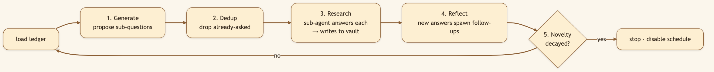
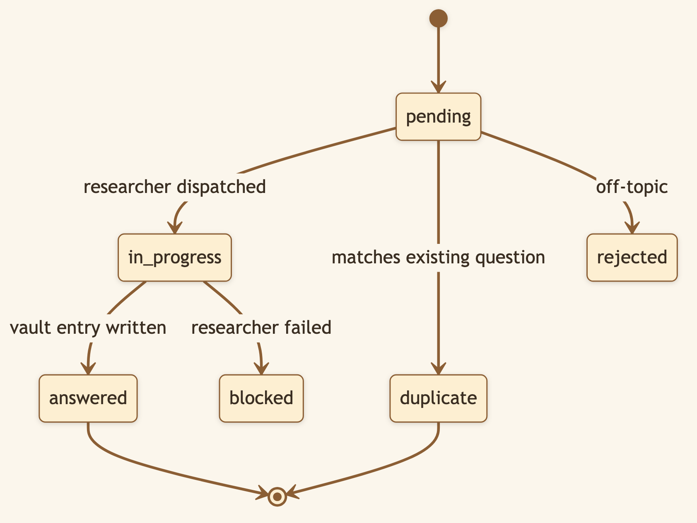
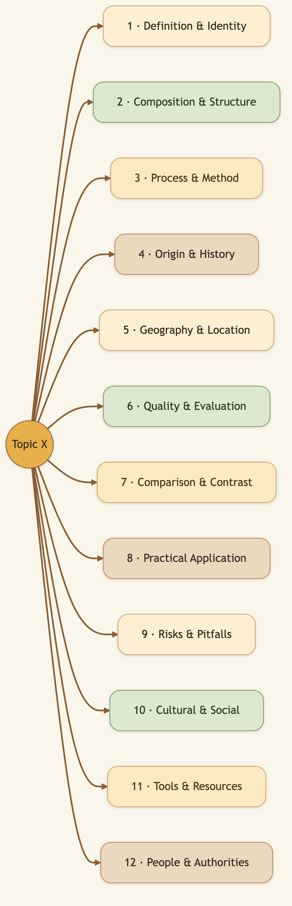
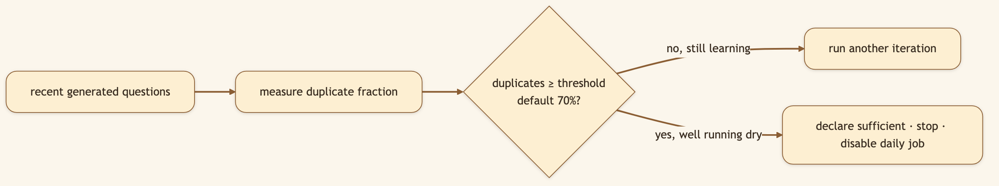

# I Pointed an AI at a Topic and Let It Research Itself. It Knew When to Stop.

> **LinkedIn hook (use as the post's first line):** "What if you could point an AI at a topic and just… let it learn? Not one query and done — a self-driving loop that keeps asking smarter questions, knows what it already covered, and stops when it stops learning."
> **Audience:** LinkedIn → Medium. Researchers, analysts, anyone who's run an agent loop that spun forever and burned the bill.

---

Deep research is mostly about asking the *right sequence* of questions and remembering which ones you've already answered. Tedious for a human; chaotic for an LLM left unsupervised. CapyHome's **Autoresearch Loop** turns it into a disciplined, self-terminating, fully-auditable process — and the thing that keeps it from spinning in circles is a **question ledger**.

> 🖼️ **[Generate: Illustration using the character from `asset/CapyHome/capybara-logo.webp` as the base. A cute cartoon capybara sits at a laptop, surrounded by stacks of books on both sides to evoke deep research. Above the capybara's head, a large thought bubble contains a tree diagram of research questions: one root question at the top branching into four child questions, each with a coloured status chip — green "✓ answered", yellow "⟳ pending", or grey "= duplicate." Internet/globe icons float in the background to suggest web-sourced knowledge. Warm cream background, fully illustrated.]**

## The idea

Pick an objective — an entity, a concept, a domain you want CapyHome to master. The loop runs in iterations, each a small cycle of *ask → check → research → reflect*.

### Diagram 1 — One iteration of the loop

Each survivor question goes to a dedicated `vault-source-researcher` [sub-agent](./08-baby-capy-subagents.md) that finds the answer, writes it into the [Knowledge Vault](./01-knowledge-vault.md), and reports back. Over many iterations the vault fills with structured, cited knowledge — without you typing a single follow-up.

## The question ledger: memory for the *questions*

The ledger is a persistent record (JSON + a human-readable markdown mirror) of every question the system has ever considered for an objective. Each question is a node with rich state.

### Diagram 2 — A question node's lifecycle

Before researching anything, new questions are checked — by token-similarity **and** by searching the vault — against everything already in the ledger. Duplicates collapse instead of triggering redundant work. **The loop never researches the same thing twice.**

## Asking *good* questions, systematically

Left alone, an LLM asks lopsided questions — ten flavors of "what is X" and nothing about risks or alternatives. The loop forces breadth with a **12-cluster question taxonomy**, working breadth-first across three depth levels and deliberately targeting empty or shallow clusters.

### Diagram 3 — The 12-cluster taxonomy forces coverage

The taxonomy lives in the vault as an **editable file** — reshape what "thorough" means for your domain.

### Diagram 4 — Knowing when to stop

It stops when it stops *learning*, not when it runs out of money.

> 🖼️ **[Generate: Illustration using the character from `asset/CapyHome/capybara-logo.webp` as the base. A cute cartoon capybara sits at a laptop, hovering a paw over the trackpad with anticipation. The illustrated screen shows an entity card with a title, a short description paragraph, and a prominent purple "⟳ Autoresearch" action button centred beneath the text. A small glowing sparkle icon next to the button suggests the loop is about to begin. Warm cream background, fully illustrated.]**

## Under the hood: how it's built

- **Composable stages** (`backend/src/control_plane/autoresearch_loop/`): `generator.py` (proposes across the taxonomy), `dedup.py` (token-Jaccard + vault search), `researcher.py` (fans out `vault-source-researcher` subagents), `reflector.py` (emits follow-ups), `stop_criteria.py` (novelty decay), `ledger.py` (thread-safe JSON + markdown persistence).
- **The question node schema** carries: content, status, `depends_on`, cluster (1–12), level (1–3), `asked_by`, a novelty score, `loop_iteration`, the `vault_entries` where the answer lives, `duplicate_of`, a researcher summary, sources used, and timestamps.
- **Scheduled, self-terminating.** Kicking off an objective runs an immediate bootstrap iteration, then schedules a daily run (≈02:00 UTC). When `iteration_summary.stop == True`, the objective flips to `completed_endpoint` and the scheduled job is disabled.
- **Tunables:** `autoresearch_max_questions_per_iteration` (8), `autoresearch_max_researcher_fanout` (3), `autoresearch_novelty_decay_threshold` (0.7), `autoresearch_dedup_similarity_threshold` (0.85).

## What we considered (and the trade-offs we made)

- **Why a ledger instead of just letting the LLM remember?** Context windows forget, and an agent that forgets its own questions asks them again forever. A durable ledger is the difference between research and a hamster wheel.
- **Why a fixed 12-cluster taxonomy?** Pure LLM-driven question generation is lopsided and shallow. A taxonomy enforces breadth (history *and* risks *and* alternatives), but we made it an editable file so it doesn't become a straitjacket.
- **Why novelty-decay as the stop signal?** A fixed iteration count either stops too early (shallow) or too late (wasteful). Watching the duplicate rate lets the *topic* decide when it's exhausted — short for narrow topics, long for deep ones.
- **Why dedup by similarity *and* vault search, not just one?** Token-similarity catches near-identical phrasings cheaply; a vault search catches questions already *answered* even if phrased very differently. Belt and suspenders, because redundant research is the most expensive failure here.

## 🎬 Video script (75–90s screen recording)

> **Title card:** "I let an AI research a topic by itself. It knew when to stop."
>
> **[0:00–0:12] Hook:** "Everyone's afraid of agent loops that run forever and burn the bill. So I built one that knows when it's done."
>
> **[0:12–0:30] Screen — start autoresearch on a topic:** "I point it at a topic and walk away. Behind the scenes it's generating questions across twelve angles — definition, history, risks, alternatives — not just 'what is it' ten times."
>
> **[0:30–0:55] Screen — open the ledger next 'day':** "Here's the question ledger. Every question it asked, its status — answered, or *duplicate* and skipped. It checks each new question against everything it's already done, so it never repeats itself."
>
> **[0:55–1:15] Screen — show the stop:** "And when most new questions start coming back as duplicates — when it stops learning — it declares the topic covered and shuts itself off. No runaway bill."
>
> **[1:15–1:25] Close:** "A research analyst that works the night shift and files everything. Open source, link below."

## Try it

> **Start autoresearch on a topic you care about. Come back the next day and read the ledger markdown — the question tree it grew, what it answered, where the knowledge landed.**

---

*Next: [Baby Capy Sub-agents →](./08-baby-capy-subagents.md) — the team that does the work in parallel.*
