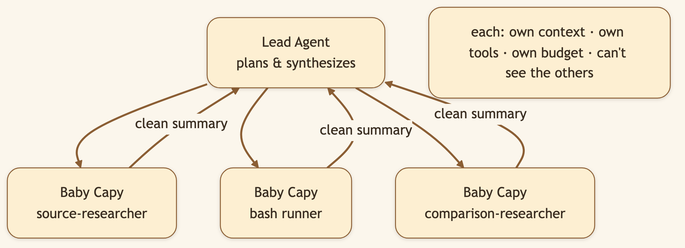
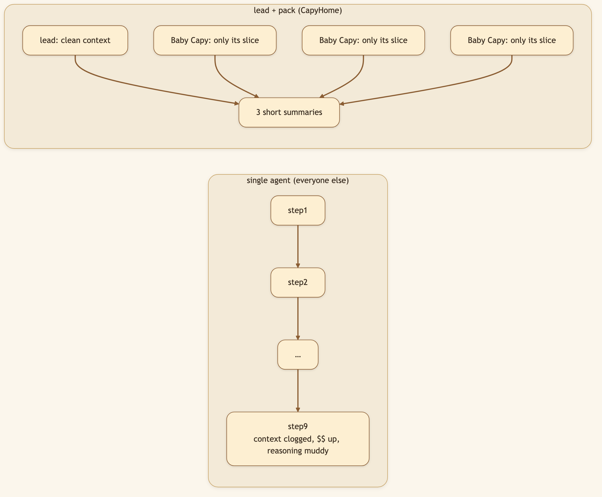
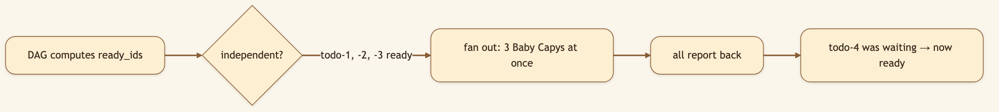

# One AI Agent Is a Bottleneck. We Run a Whole Team in Parallel.

> **LinkedIn hook (use as the post's first line):** "Most 'AI agents' are a single chat loop doing one thing at a time, with a context window slowly clogging with junk. We run it like a team instead: one lead, a pack of parallel sub-agents, each in its own clean room."
> **Audience:** LinkedIn → Medium. Agent builders, eng leaders, anyone who's watched a single-threaded agent crawl through fan-out work.

---

Give a single agent a big task and two things go wrong. It's **serial** — one source, one section, one check at a time. And its context **degrades** — by step nine the window is clogged with the debris of steps one through eight, and reasoning gets muddy and expensive.

The fix is the one human teams discovered long ago: divide the work, and give each person a clean desk.

> 🖼️ **[User add: image containing — the activity timeline with multiple live "Baby Capy — {type}" delegates running at once. Capture from a real fan-out task in the running app.]**

## The lead-and-pack model

CapyHome's lead agent doesn't do everything itself. It breaks a task into pieces and spawns **Baby Capy sub-agents** — up to three at once per turn. Each gets its **own scoped context**, its **own tools**, and its **own termination conditions** (a turn budget and a timeout). Critically, sub-agents **can't see each other's state** — that isolation keeps reasoning clean and tokens cheap, and the lead gets back tidy *summaries* instead of a firehose.

### Diagram 1 — Lead delegates, summaries flow back

### Diagram 2 — Context isolation is the whole point

## Parallelism that respects dependencies

This ties straight to [Plan Mode's todo DAG](./03-plan-and-work-mode.md). Steps with no unmet dependencies are *ready* — and ready steps fan out to Baby Capys **simultaneously**.

### Diagram 3 — DAG "ready" set → parallel fan-out

"Research three competitors" becomes three Baby Capys working at once; "then synthesize" waits for all three. Speed of parallelism, none of the chaos.

> 🖼️ **[User add: image containing — a labelled diagram or screenshot mapping a plan's parallel todos to the Baby Capys executing them. Could be a clean annotated version of Diagram 3.]**

## Under the hood: how it's built

- **Concurrency + budgets:** up to **3 concurrent** sub-agents per turn, each with a **15-minute timeout**.
- **Built-in delegates:** `general-purpose` and `bash` for everyday work.
- **Research specialists:** `source-researcher` and `comparison-dimension-researcher` get a larger **25-turn budget** for deep evidence-gathering; the autoresearch loop uses `vault-source-researcher`.
- **Delegation tool:** the lead spawns workers via the `task` tool (available in Work Mode's full catalog, not Plan Mode's read-only one).
- **Transparency:** the activity timeline labels every live delegate `Baby Capy — {type} …`, so you can trace exactly who did what.

## What we considered (and the trade-offs we made)

- **Why isolate sub-agent context instead of sharing it?** Shared context is simpler to build but is exactly what clogs a single agent. Isolation means each worker reasons on a clean, minimal context — cheaper tokens, sharper output — at the cost of the lead having to define each delegation crisply.
- **Why cap at 3 concurrent?** More parallelism sounds better but multiplies cost, rate-limit pressure, and the chance of redundant work. Three is the sweet spot where fan-out clearly pays off without the coordination overhead exploding.
- **Why give researchers a bigger turn budget?** Evidence-gathering genuinely needs more turns than a quick shell command. Differentiated budgets stop us from either starving research or over-funding trivial tasks.
- **Why summaries back to the lead instead of raw transcripts?** The lead's value is synthesis, and synthesis dies under a firehose. Summaries keep the lead's context clean enough to actually reason across everything the pack found.

## 🎬 Video script (60–75s screen recording)

> **Title card:** "One AI agent is a bottleneck. Watch a whole team work."
>
> **[0:00–0:10] Hook:** "Most AI agents do one thing at a time. For real work, that's painfully slow. Here's what parallel looks like."
>
> **[0:10–0:30] Screen — give a fan-out task:** "I ask it to compare four tools across price, features, and support. A single agent would grind through these one by one."
>
> **[0:30–0:55] Screen — timeline lights up:** "Instead — watch the timeline. Multiple Baby Capys spin up at once, each researching one tool in its own isolated context. The lead just waits for their summaries."
>
> **[0:55–1:10] Screen — synthesis step:** "Once they all report, the lead synthesizes. Independent work in parallel; dependent work in order. Fast *and* coherent."
>
> **[1:10–1:20] Close:** "The capybara is the animal everything gets along with. Calm on top, a coordinated team underneath. Open source, link below."

## Try it

> **Give CapyHome a task with obvious parallel parts ("compare these four tools across price, features, and support") and watch the timeline light up with multiple Baby Capys at once.**

---

*Next: [Skills →](./09-skills.md) — how CapyHome learns new tricks without bloating.*
