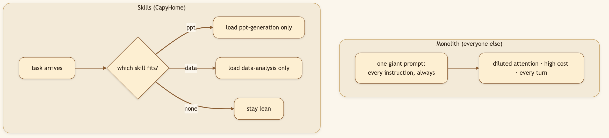
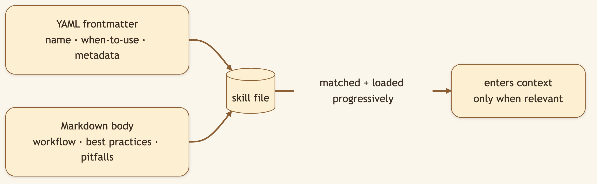

# The Secret to a Capable AI Agent Isn't More Instructions. It's Fewer.

> **LinkedIn hook (use as the post's first line):** "There are two ways to make an AI agent capable. One is to cram every instruction into one giant prompt — slow, confused, expensive. We took the other path: modular Skills that load only when the task needs them."
> **Audience:** LinkedIn → Medium. Prompt/agent engineers, builders fighting context bloat and cost.

---

Imagine teaching someone to cook by reading them the *entire cookbook* — every recipe, every technique — before they're allowed to make toast. That's what a monolithic system prompt does to an agent. Every token of "how to build a PowerPoint" sits in context even when you asked a one-line question, diluting attention and inflating cost.

**Skills** solve this like a good reference library: the knowledge exists, but you only pull the relevant book off the shelf when you need it.

> 🖼️ **[Generate: Split-panel illustration using the character from `asset/CapyHome/capybara-logo.webp` as the base. Left panel labelled "Without Skills": a cartoon capybara slumped under the weight of a single enormous scrolling text prompt spilling off the desk — looking exhausted. Right panel labelled "With Skills": the same capybara sitting upright and happy at a laptop, with a tidy bookshelf of small rounded skill cards beside it — each card shows a name and icon (e.g. "deep-research 🔍", "ppt-generation 📊") and one card glows purple labelled "Loaded now." Warm cream background, strong contrast between left and right.]**

### Diagram 1 — Progressive loading vs. the monolith

### Diagram 2 — Anatomy of a skill

## What ships in the box

20+ skills across the spectrum of real work — proof this isn't a coding-only tool:

| Category | Skills |
|---|---|
| **Research** | deep-research, github-deep-research, find-skills |
| **Generation** | ppt-generation, podcast-generation, video-generation, pdf-pro |
| **Data** | data-analysis, excel-modeling, chart-visualization, consulting-analysis |
| **Design** | frontend-design, web-design-guidelines, bootstrap |
| **Workflow** | batch-workflow, dreamy-workflow |
| **Meta** | skill-creator, knowledge-vault, surprise-me |

"Make me a slide deck," "model this in a spreadsheet," "draft a podcast," "analyse this dataset" each quietly pull in the one skill built for that craft — and only that one.

### Diagram 3 — Skills compose (and write themselves)

> 🖼️ **[Generate: Illustration using the character from `asset/CapyHome/capybara-logo.webp` as the base. A cute cartoon capybara sits at a laptop, studying the screen thoughtfully with one paw on chin. The illustrated screen shows a code editor with a skill file open: visible YAML frontmatter at the top (keys: "name:", "description:", "tools:") separated by "---" from a markdown body below containing a short workflow instruction paragraph. The file is titled "ppt-generation.md" in a small tab at the top. Warm cream background, fully illustrated.]**

## Under the hood: how it's built

- **Format:** each skill is Markdown + YAML frontmatter — the frontmatter declares the name and when-to-use signal; the body encodes the workflow and best practices.
- **Progressive loading:** a skill's full instructions only enter context when the task matches it, so working memory stays lean and reasoning stays sharp.
- **Author your own:** drop a skill into `skills/custom/` (gitignored — it stays yours). `skill-creator` scaffolds new ones for you; `find-skills` lets the agent discover which capability it needs; `surprise-me` picks something fun.
- **Extend without forking:** new capability is a new file, not a code change.

## What we considered (and the trade-offs we made)

- **Why progressive loading over one big prompt?** A monolith is simplest to ship but degrades every single request — irrelevant instructions dilute the model's attention and you pay to carry the whole cookbook on a one-liner. Progressive loading costs a matching/selection step but keeps every turn lean.
- **Why Markdown + YAML instead of code plugins?** Skills are *knowledge*, not just function calls — "do X *well*," the way an expert would. Markdown makes them writable by non-programmers and readable by everyone; YAML frontmatter gives just enough structure to route them.
- **Why gitignore `skills/custom/`?** Your proprietary workflows are yours. Keeping custom skills out of the repo by default means your edge doesn't leak into a public tree.
- **Why a `skill-creator` skill?** The fastest way to grow capability is to let the agent help build the modules that make it more capable — meta, but it removes the blank-page friction of authoring.

## 🎬 Video script (45–60s screen recording)

> **[0:00–0:10] Hook:** "Counterintuitive: the secret to a *more* capable AI agent is giving it *fewer* instructions at a time."
>
> **[0:10–0:30] Screen — ask for a slide deck, then a data analysis:** "I ask for a slide deck — it pulls in just the presentation skill. Then I ask for a data analysis — different skill, loaded only now. The agent never carries instructions it doesn't need."
>
> **[0:30–0:50] Screen — skill-creator scaffolds one:** "And these are just files. I can write my own — or have skill-creator scaffold one for me — and the agent immediately knows the new trick."
>
> **[0:50–1:00] Close:** "A calm generalist that's genuinely good at specific crafts, because it only thinks about what's in front of it. Open source, link below."

## Try it

> **Ask for something specific — "build a 10-slide deck on X" — and watch the relevant skill engage. Then scaffold your own with `skill-creator`.**

---

*Next: [Local-First & Bring Your Own Brain →](./10-local-first-byob.md).*
