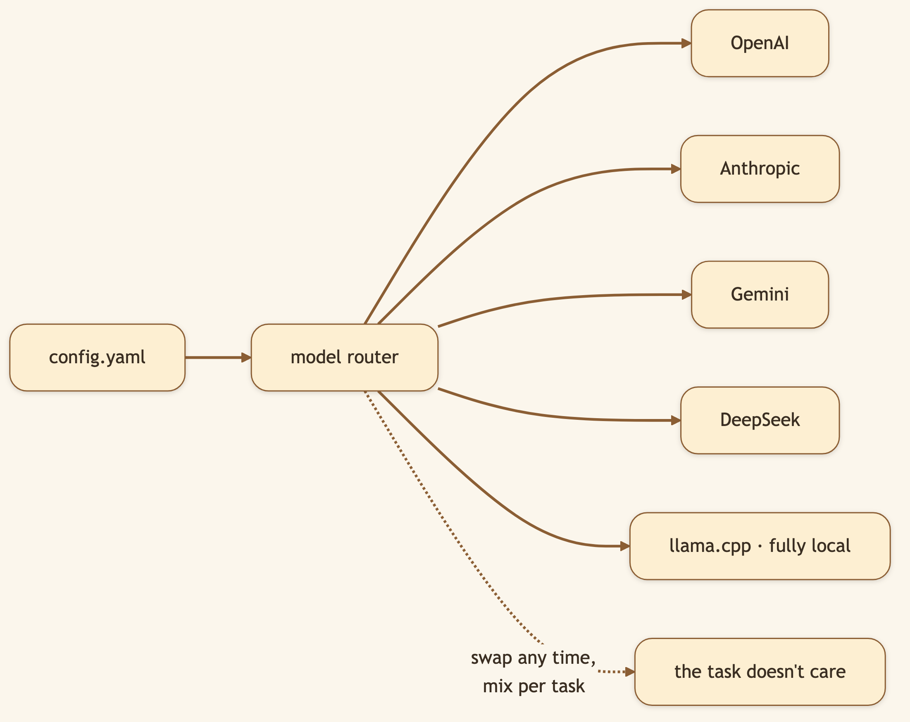
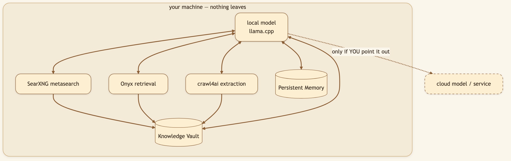
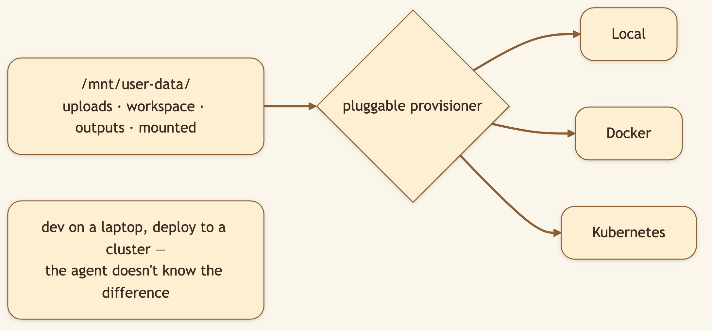

# Your Best Work Can't Go in the Cloud. So We Built an AI That Never Leaves Your Machine.

> **LinkedIn hook (use as the post's first line):** "Two questions decide whether you can trust an AI with real work: whose model is this, and where does my data go? Our answer to both is the same — yours, and nowhere you don't choose."
> **Audience:** LinkedIn → Medium. Privacy-conscious engineers, regulated industries, self-hosters, anyone who can't paste client data into a SaaS box.

---

The most valuable work — proprietary code, client documents, financial models, legal research — is exactly the work you *can't* paste into someone else's cloud. That's the ceiling most AI tools hit. CapyHome doesn't have that ceiling.

> 🖼️ **[User add: image containing — a "data never leaves the machine" diagram: a laptop outline containing the model + research stack + vault, with a struck-through cloud outside it. Strong LinkedIn hero image.]**

## Bring your own brain

CapyHome isn't married to any provider. Define models in `config.yaml` and mix them freely:

- **OpenAI, Anthropic, Google Gemini, DeepSeek** — out of the box.
- **Fully local via llama.cpp** — no cloud model at all.
- **Mix per task** — frontier model for planning, cheap or local one for grunt work.

```yaml
models:
  - name: gpt-4
    display_name: GPT-4
    use: langchain_openai:ChatOpenAI
    model: gpt-4
    api_key: $OPENAI_API_KEY
```

### Diagram 1 — The brain is a setting, not a foundation



## Local-first, not local-only

"Local-first" means the *default* is that nothing leaves — but you're never *trapped* offline. The full research stack runs locally:

```bash
make local-stack-start    # SearXNG + Onyx + crawl4ai, all on your box
```

### Diagram 2 — The fully-local loop



Pair a local model with the local stack and you have a complete, capable agent that **never phones home** — queries, documents, [mounted folders](./05-slash-commands-mount-analyse.md), [vault](./01-knowledge-vault.md), all on hardware you control.

## Everything runs in a sandbox

### Diagram 3 — One sandbox, three runtimes



> 🖼️ **[User add: image containing — a real screenshot of config.yaml with multiple models defined (one cloud, one local llama.cpp). A clean editor screenshot.]**

## Self-hosted and MIT-licensed

CapyHome is open source under the **MIT license** — read every line, run it on your own infra, fork it, build on it. No hidden telemetry, no mandatory account, no server you're forced to trust. The privacy guarantee isn't a policy promise; it's a property of *where the code runs*.

## Under the hood: how it's built

- **Provider abstraction via LangChain** — each model entry names a `use:` class (e.g. `langchain_openai:ChatOpenAI`) and its params, so adding a provider is config, not code.
- **Local stack** = SearXNG (metasearch) + Onyx (retrieval) + crawl4ai (extraction), orchestrated by `make local-stack-start` / `-status`.
- **Sandbox** lives at `/mnt/user-data/` (uploads / workspace / outputs / mounted) and is provisioned **Local**, **Docker**, or **Kubernetes** through one pluggable provisioner.
- **Channels** (Slack, Telegram) and **MCP** servers extend reach without changing the core.

## What we considered (and the trade-offs we made)

- **Why support local models when cloud frontier models are stronger?** Because "stronger" is irrelevant if policy or privacy forbids sending the data. We'd rather you run a smaller model on your own box than not use the tool at all. Mix-per-task lets you use the big model where the data is safe to send.
- **Why local-first instead of local-only?** Purely offline would be a smaller, less useful tool. Local-*first* gives the privacy default while leaving the door open to cloud power when *you* decide a task warrants it.
- **Why MIT rather than a source-available license?** Trust. A privacy claim you can't independently verify is marketing. MIT means you can audit, self-host, and fork without permission — the strongest possible backing for "your data, your rules."
- **Why one sandbox abstraction across Local/Docker/K8s?** So the dev-to-production path is config, not a rewrite — the same agent behavior whether it's your laptop or a cluster.

## 🎬 Video script (60–75s screen recording)

> **Title card:** "An AI that never leaves your machine."
>
> **[0:00–0:12] Hook:** "My most valuable work — client docs, proprietary code — can't go into someone else's cloud. That's where most AI tools become useless to me. So I ran one entirely on my own machine."
>
> **[0:12–0:30] Screen — config.yaml with a local model:** "Here's the config. I point it at a local llama.cpp model. No cloud brain. Then I start the local research stack — search and crawling, all on my box."
>
> **[0:30–0:50] Screen — unplug network, run a research task:** "Watch this — I'll disconnect from the internet entirely… and it still researches, reasons, and files everything into the vault. Nothing left the room."
>
> **[0:50–1:05] Screen — show MIT license / repo:** "And it's MIT-licensed and self-hosted, so the privacy isn't a promise in a policy — it's a property of where the code runs. I can read every line."
>
> **[1:05–1:15] Close:** "Calm, capable, and entirely yours. Link below."

## Try it

> **`make local-stack-start`, point `config.yaml` at a local llama.cpp model, then do a full research task with your network unplugged. It works — and nothing left the room.**

```bash
git clone https://github.com/CapyHome/CapyHome.git && cd CapyHome && make config && make docker-start
```

---

*Next: [The Browser Clipper →](./11-browser-clipper.md).*
