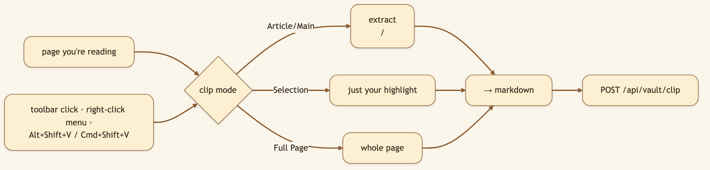
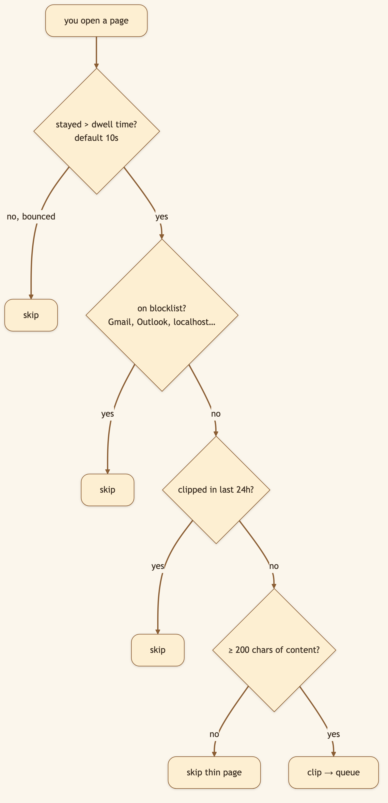

# I Stopped Bookmarking Things. Now My Browser Feeds an AI Knowledge Base Automatically.

> **LinkedIn hook (use as the post's first line):** "The best knowledge base is the one that fills itself. So I stopped bookmarking — now a browser extension clips what I read straight into my AI's memory, as clean markdown, automatically."
> **Audience:** LinkedIn → Medium. Researchers, PKM/second-brain enthusiasts, anyone with 4,000 dead bookmarks.

---

You're reading a great article. You know future-you will want it. So you do the dance: copy the URL, paste it somewhere, promise to file it properly later. You never do. The **Knowledge Vault Clipper** removes the dance: see something worth keeping, and it's in your [vault](./01-knowledge-vault.md) — as clean, indexed markdown — before you've finished the thought.

> 🖼️ **[Generate: Illustration using the character from `asset/CapyHome/capybara-logo.webp` as the base. A cute cartoon capybara sits at a laptop with a browser open on screen. In the top-right corner of the illustrated browser, a small extension popup is shown floating open: three illustrated clip-mode buttons stacked vertically ("📄 Clip Page", "✂️ Clip Selection", "🔗 Clip Link"), and below them a green confirmation banner reading "✓ Queued for ingestion." The capybara looks at the popup with a satisfied expression. Warm cream background, fully illustrated.]**

## Three ways to clip

### Diagram 1 — Manual clip paths

A green checkmark badge and a "✓ Queued for ingestion" pill confirm it landed.

## Auto-clip: a vault that fills itself

The game-changer. **Auto-clip mode** (on by default) captures public pages automatically as you browse — built to be thoughtful, not greedy.

### Diagram 2 — The auto-clip decision

- **Dwell time** — only clips pages you actually *read*, not ones you bounce off.
- **24h dedup** — revisits don't pile up.
- **Sensible blocklist** — your inbox doesn't end up in your research vault.
- **Min-content floor** — thin, navigation-heavy pages are skipped.

Toggle it off anytime from the popup.

## It all flows into one pipeline

### Diagram 3 — Clipper → vault → searchable knowledge

Three on-ramps, one library: what the agent **searches**, what it **researches on its own**, and what *you* **read**.

> 🖼️ **[Generate: Illustration using the character from `asset/CapyHome/capybara-logo.webp` as the base. A cute cartoon capybara sits at a laptop, pointing at the screen with one paw. The illustrated screen shows a Chrome-style extensions settings page with a "Developer mode" toggle switched on and a highlighted "Load unpacked" button. A folder selection dialog overlays the screen with a folder named "knowledge-vault-clipper" selected and highlighted in blue. The capybara gestures toward the folder. Warm cream background, fully illustrated.]**

## Under the hood: how it's built

- **Manifest V3 extension**, Chrome + any Chromium browser (Brave, Edge). Small and transparent: `content.js` extracts, `background.js` dedupes and enqueues, `popup.js` drives the UI.
- **Extraction:** `document.querySelector("article, main")` for Article mode, `window.getSelection()` for Selection, `document.body.innerText` for Full Page — emitted as markdown with title, source URL, and optional operator notes.
- **One endpoint:** `POST /api/vault/clip` with `{ url, title, markdown, topic, topic_tags }`; the backend queues it and returns `{ status: "queued", … }`. From there it rides the same ingestion pipeline as everything else.
- **Defaults:** auto-clip on, 10s dwell, 24h per-URL dedup, 200-char minimum, blocklist seeded with Gmail/Outlook/Google accounts/localhost. All configurable in the popup (stored in `chrome.storage.local`).
- **Install:** `chrome://extensions` → Developer mode → Load unpacked → `browser_extensions/knowledge-vault-clipper`; confirm the API base points at your backend (default `http://127.0.0.1:8001`).

## What we considered (and the trade-offs we made)

- **Why a dwell timer instead of clipping on page load?** Clipping everything you *open* fills the vault with tabs you bounced off in two seconds. A dwell timer is a cheap, reliable proxy for "I actually read this."
- **Why a default blocklist instead of an empty one?** Auto-capture + a webmail tab = your private email in a research vault. Shipping a sensible blocklist (and letting you edit it) makes the safe default the *out-of-the-box* default.
- **Why markdown, again?** Same reason as everywhere else — it's the [pipeline's native format](./06-websearch-markdown.md), so a clip ingests with zero lossy conversion.
- **Why unpacked dev-mode install rather than a store listing?** It keeps the extension fully local and inspectable, with no store-review gatekeeper between you and your own tool. The trade-off is a one-time manual load.

## 🎬 Video script (45–60s screen recording)

> **Title card:** "I stopped bookmarking. My browser feeds my AI now."
>
> **[0:00–0:10] Hook:** "I have four thousand dead bookmarks I've never reopened. So I stopped saving links — and started clipping into my AI's memory instead."
>
> **[0:10–0:25] Screen — read an article, hit the shortcut:** "Great article. One shortcut — and it's captured as clean markdown, straight into my knowledge vault. Done."
>
> **[0:25–0:45] Screen — show auto-clip + popup settings:** "But here's the real trick: auto-clip. As I actually *read* pages — not the ones I bounce off — it files them automatically. It skips my inbox, skips duplicates, skips thin pages."
>
> **[0:45–1:00] Screen — search the vault for something read earlier:** "Later, I search my vault — and everything I read is already there, indexed and ready. Open source, link below."

## Try it

> **Load the extension, turn on auto-clip, read a few articles. Then open your vault and search — the things you read are already there.**

---

*Back to the [series index](./00-index.md).*
