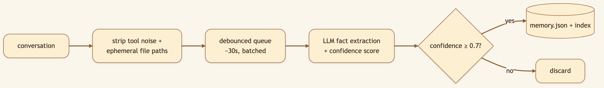
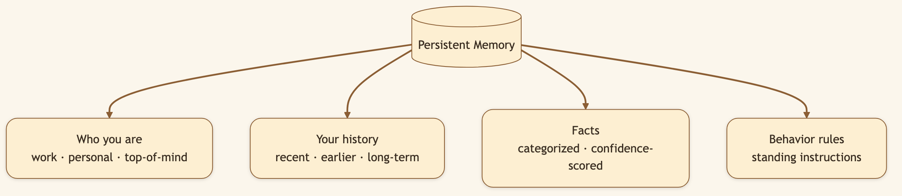
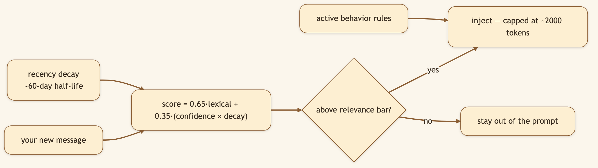
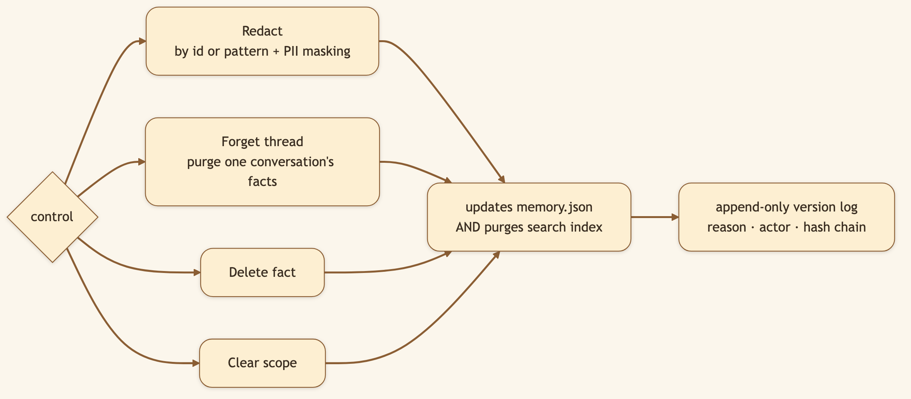

# An AI That Remembers You — Not Your Chat History, But You.

> **LinkedIn hook (use as the post's first line):** "Every fresh chat with a normal assistant starts from amnesia — you re-explain your stack, your preferences, your project, again. We built memory that learns *you* and carries it across every session."
> **Audience:** LinkedIn → Medium. Power users, developers, anyone tired of re-briefing their AI every morning.

---

The [Knowledge Vault](./01-knowledge-vault.md) remembers the **world** — the things you research. **Persistent Memory** remembers **you** — how you work, what you prefer, what you're focused on this month. It's the difference between an assistant you re-brief every morning and one that already knows the drill.

> 🖼️ **[User add: image containing — a real screenshot of the memory panel in the UI showing extracted facts with categories + confidence scores, and a behavior rule. Capture from the running app's memory view.]**

## It learns by itself

You don't fill out a profile. After a conversation, an LLM **extracts facts** — preferences, expertise, goals, working patterns — each with a category and an explicit **confidence score**. Only facts above a threshold (default **0.7**) are kept.

### Diagram 1 — How a conversation becomes durable memory

### Diagram 2 — What memory holds

## Only the *relevant* memories show up

A naïve system dumps everything into the prompt and drowns the model. CapyHome retrieves by relevance to *your current message* — and respects **recency**.

### Diagram 3 — Relevance-filtered, recency-decayed, token-capped injection

The agent surfaces the three things that matter for what you just asked — not the eighty things it knows in total. Last quarter's priorities fade behind this week's.

## Privacy you can actually exercise

Memory you can't inspect or delete is a liability. CapyHome's memory is a **local JSON file you own**, and every control is real.

### Diagram 4 — Forgetting is real, not hidden

A forgotten fact is genuinely gone — not just hidden — and optional **append-only versioning** records each change with a reason and a hash chain for audit-grade accountability.

> 🖼️ **[User add: image containing — the redact/forget controls in the memory UI, or a snippet of memory.json on disk showing facts + confidence. Capture from the running app or the file.]**

## Under the hood: how it's built

- **Storage:** `.capyhome/memory.json`, in two scopes — **global** (you everywhere) and **workspace** (per-project) — merged at injection time with workspace taking precedence.
- **Extraction:** `MemoryMiddleware` captures user inputs + final responses (no tool calls), a `MemoryUpdateQueue` debounces (~30s, configurable), and `MemoryUpdater` calls an extraction LLM that emits `newFacts` / `factsToRemove` with confidence scores.
- **Retrieval:** a SQLite-backed index scores `0.65·lexical + 0.35·(confidence × decay)` with a configurable half-life (default 60 days); injection is capped (default 2000 tokens, measured with tiktoken).
- **Controls + API:** `recall` tool for explicit fetch; `/api/memory/{redact,forget-thread,clear,facts,rules,versions}`; PII masking on redaction; optional optimistic-concurrency via `expected_sha`.
- **Tunables:** `fact_confidence_threshold` (0.7), `max_facts` (100), `decay_half_life_days` (60), `max_injection_tokens` (2000), `injection_relevance_threshold` (0.5).

## What we considered (and the trade-offs we made)

- **Why automatic extraction instead of a profile you fill in?** Profiles go stale the day you write them. Learning from actual conversations keeps memory current — at the cost of needing a confidence gate so it doesn't store noise.
- **Why relevance-filter injection instead of injecting everything?** Dumping all memory into context drowns the task and burns tokens. Filtering by relevance + recency keeps the prompt sharp; the trade-off is occasionally missing a fact the scorer ranked low (mitigated by the explicit `recall` tool).
- **Why a separate system from the Knowledge Vault?** The vault is about the *world*; memory is about *you*. Different lifecycles, different privacy controls, different injection rules — conflating them would muddy both.
- **Why local JSON + append-only versioning?** A memory you can't read, edit, or audit is a trust problem. A local file you own, with a hash-chained change log, makes "forget that" a real, verifiable operation — important for anyone with compliance needs.

## 🎬 Video script (45–60s screen recording)

> **Title card:** "An AI that remembers *you*, not your chat history."
>
> **[0:00–0:10] Hook:** "Every new chat, I re-explain who I am, what I use, what I'm working on. Exhausting. So I gave my AI a real memory."
>
> **[0:10–0:25] Screen — chat 1, state a preference:** "In one chat I just mention: I like concise answers, no preamble, and I work in TypeScript. That's it — no form to fill."
>
> **[0:25–0:45] Screen — brand new chat next 'day':** "New chat, next day. I ask something — and it answers concisely, in my stack, *without being reminded.* Here's the memory panel: it extracted those facts on its own, with confidence scores."
>
> **[0:45–1:00] Screen — redact a fact:** "And it's all a local file I control. Don't like what it learned? Redact it — gone from the file *and* the index. Open source, link below."

## Try it

> **Tell CapyHome a preference in one chat. Start a brand-new chat the next day and watch it honor that unprompted. Then open the memory panel and delete anything you don't like.**

---

*Back to the [series index](./00-index.md).*
