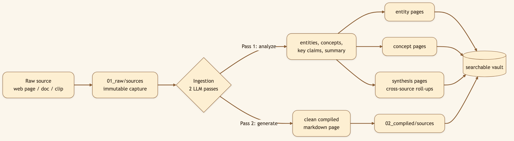
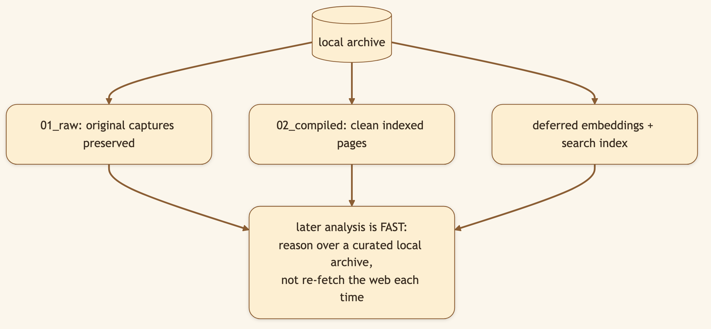

# The Most Expensive Research Is the Research You Already Did

> **LinkedIn hook (use as the post's first line):** "AI research feels fast until you notice it keeps paying to rediscover the same articles. We built a cache for knowledge, not just web pages."
> **Audience:** LinkedIn -> Medium. Researchers, RAG engineers, analysts, and teams that repeatedly revisit the same domains.

---

You've spent two hours reading whitepapers on battery supply chains. You extracted three key constraints, seven competing manufacturers, and a timeline of industry shifts. You write your report. You move on.

Three weeks later, a follow-up question arrives: *How does this relate to vertical integration in chip design?* You know you've seen something relevant before. But the context is gone. So you search again. You skim the same three whitepapers. You re-extract the same facts. You move forward two hours poorer.

That loop—searching, reading, extracting, discarding, then repeating—is how most AI research systems operate by default. Each conversation is a clean slate. Each search starts from zero. Knowledge compounds in your brain, not in your tools.

CapyHome's **Knowledge Vault** starts from a different premise: useful research should become infrastructure for future research.

It acts like a cache, but not a conventional browser cache. It does not merely preserve a copy of a URL. It turns source material into searchable pages organized around **entities** and **concepts**, with summaries, claims, references, open questions, and links back to evidence.

## Why "save every page" is not enough

You download 47 articles into a folder. Problem solved, right? No. Three months later:

- You remember the insight but not the title. Search through 47 files manually.
- You ask about "organizational autonomy"—the article calls it "decentralized decision-making." Your keyword search misses it.
- You want everything about Tesla from three different sources, scattered across folders for "EVs," "supply chains," and "manufacturing."

A pile of documents solves disappearance, not retrieval. **The vault reorganizes for retrieval.**

It creates two types of pages that compound across sessions:

- **Entity pages** collect everything about a named thing—a company, product, person, or place. One vault entry for Tesla includes battery-chain constraints from Article A, margin pressures from Article B, and manufacturing capacity from Article C.
- **Concept pages** collect recurring themes—battery supply chains, vertical integration, manufacturing yield, pricing power. When you ingest a new article about Ford, both the Ford entity page *and* the battery supply-chain concept page get stronger.

A source about electric vehicles ceases to be "that one article I read." It becomes evidence that strengthens multiple questions you'll ask in the future. The thought process is simple: organize knowledge around what future questions will refer to, not around the chat that happened to discover it.

## Search once, reuse many times

When WebSearch finds a relevant article, CapyHome queues it for vault ingestion. Deduplication filters (URL + content hash), trust gates, and weak-source rejection happen automatically. The result: organized, searchable entity and concept pages ready for the next question.

Next time a related question arrives, the agent retrieves from the vault before hitting the open web.

This creates measurable leverage:

- **Lower latency:** vault retrieval (~50ms) beats web crawl + extraction (~3-5s). A follow-up query runs twice as fast.
- **Lower cost:** re-extracting the same article costs tokens every time. Vault reuse costs zero additional tokens.
- **Greater consistency:** five queries spanning three months can now reference the *same* underlying evidence, not five independent interpretations.
- **Resilience:** if an article moves or disappears, the vault copy remains. No broken references, no lost context.
- **Cumulative depth:** your first deep-dive on battery supply chains becomes infrastructure for the next project. Each new ingestion strengthens existing entities and concept pages rather than starting from scratch.

## A concrete example

**Day 1—The first question:** "Can Figma sustain 40%+ ARR growth while improving gross margins above 75%?"

You spend ninety minutes gathering five earnings reports, CEO interviews, customer testimonials, pricing pages, and analyst notes. CapyHome extracts:
- Entity page: **Figma** (market position, unit economics, customer mix)
- Concept pages: **operating leverage**, **customer concentration**, **freemium-to-paid conversion**, **AI-as-margin-driver**

The vault now contains structured evidence across twenty ingested sources.

**Day 15—A follow-up lands:** "How does Figma's unit economics compare with Canva's? What does that imply for Figma's margin story?"

A stateless system searches again. Same sources. Re-extracts the same facts. Burns tokens on redundant work.

CapyHome retrieves:
- The Figma entity page (90% of what you need already compiled)
- The unit-economics concept page (already structured across sources)
- Live search only for: *new* public Canva metrics, *new* quarterly results, or *new* analyst reports

The second question takes 15 minutes instead of 90. The reasoning builds on the same evidence base, not five independent interpretations.

**The real leverage isn't "never search again."** It's **search selectively because you already know what you have**.

## Hybrid retrieval protects both precision and recall

The vault uses keyword *and* semantic search in parallel, fused into one result set.

**Keyword search** excels at exactness: ticker symbols, product names, quotations, financial figures. You search `"iPhone 15 unit sales Q4 2024"` and find the exact sentence.

**Semantic search** excels at meaning: you ask about "margin drivers in SaaS" and it retrieves insights about "operating leverage" and "unit economics"—different words, same idea.

Most RAG systems force a choice: be exact or be flexible. The vault does both. Search for the ticker *and* for the concept simultaneously; rank results that match either signal.

The index stays local, file-backed, and readable markdown—not locked inside a remote vector database. You own it. You can inspect it. You can prune it.

## Why the vault also needs pruning

A vault that swallows every article, duplicate, nav fragment, and weak source becomes a *search problem*, not a solution. CapyHome includes trust gates, deduplication, linting, and pruning.

**Deletion is not a bug—it is part of curation.** Human researchers don't weight every search result equally. They ignore shallow pieces, duplicates, and noise. A good vault does the same. A source that says "This adds no durable value" belongs in the trash, not cluttering future searches.

The system offers dry-run controls: see what would be deleted and *why* before the vault changes. Pruning is explicit, inspectable, reversible until you confirm it.

## The impact on deep research

The vault transforms deep research from a series of isolated sprints into a program of accumulated work.

**Week 1**: You establish the core entities (companies, products, key people) and concepts (market dynamics, unit economics, regulatory landscape). Vault populated with fifty sources.

**Week 2**: A gap emerges—pricing models across competitors. Auto-research fills it. Twelve new sources ingest into existing concept pages.

**Week 3**: You manually clip three blog posts about regulatory shifts and add them to the vault.

**Week 4**: A live market event changes unit economics. One new web search updates time-sensitive claims. No redundant rediscovery.

The evidence base grows *in the shape of your interests*, not in the shape of search-term randomness. Over time, the system shifts from "What did I know about X?" to "What *new* have I learned about X since last time?"

That is what compounding knowledge means: not remembering the conversation, but *preserving the work*.

## Video script (40-55 seconds, vertical Short)

> **[0:00-0:06] Hook:** Show the same prompt in two fresh chatbot windows. "Why does AI keep researching the same articles twice?"
>
> **[0:06-0:19] First task:** Show CapyHome searching once, then creating entity and concept pages in the vault.
>
> **[0:19-0:34] Follow-up:** Start a new thread and ask a related question. Highlight vault retrieval before live web search.
>
> **[0:34-0:47] Impact:** Split screen: "Search everything again" versus "Reuse what we know, search only the gaps."
>
> **[0:47-0:55] Close:** "The cheapest research is the research you already did and kept."

---

*Next: [Plan, Work, or Auto: Choosing the Right Level of Control ->](./16-plan-work-auto-modes.md).*
