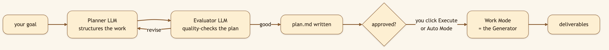
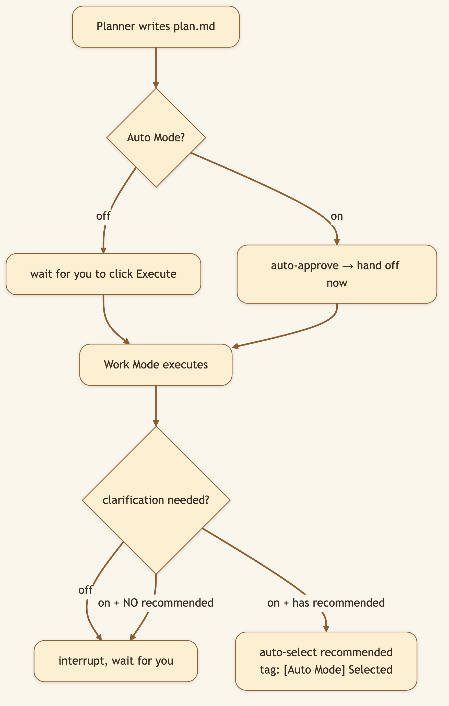

# The Best AI Mode Depends on How Expensive It Is to Be Wrong

> **LinkedIn hook (use as the post's first line):** "Simple tasks need momentum. Complex research needs a plan. Trusted workflows need autonomy. One AI mode should not pretend those are the same problem."
> **Audience:** LinkedIn -> Medium. Researchers, operators, and agent builders deciding how much control to keep during execution.

---

You ask an AI: "Help me summarize these notes into a comparison table." It starts immediately. Two minutes later, you have it. The cost of being wrong? Nothing. You edit the columns and move on.

Next request: "Should we acquire Company X?" You want an analysis of market position, runway, technology moat, team depth, and customer concentration. An AI starts immediately, generates a sprawling search strategy, makes three assumptions about what "acquisition risk" means, runs for ninety minutes, and hands you analysis that might be completely wrong *because it misunderstood the question.*

These are not the same problem. The cost of being wrong is not constant.

- Drafting five title ideas: cheap to redo.
- A multi-hour market analysis: wastes dozens of searches if the framing is wrong.
- An overnight research run: should not pause at 2:00 a.m. asking permission to choose what it already recommends.

CapyHome makes that cost visible through three distinct modes.

CapyHome makes that decision visible through **Work Mode**, **Plan Mode**, and the **Auto Mode** modifier.

## Work Mode: straight execution when the path is already clear

Use Work Mode when you know what you want and there is no room for misinterpretation:

- Summarize this folder of documentation
- Turn these notes into a comparison table
- Research three named competitors and extract pricing models
- Fix the error at line 156 in this file
- Generate a report using this outline I'm providing

The agent receives its full toolset and starts immediately. No planning ceremony, no clarification loop. You get momentum—one intent, execution begins.

**When to use:** You already know the dimensions that matter, the output format is clear, the cost of a wrong assumption is near zero.

**What happens:** The agent researches, synthesizes, or edits in parallel subagents, and returns an artifact two minutes later. You revise if needed. Done.

**Real example:** "Compare storage costs across AWS, GCP, and Azure for 100 TB/month transfer." You know the comparison axes. The agent knows where to find current pricing. No ambiguity. Work Mode is right.

## Plan Mode: catch misunderstandings before you waste hours

Use Plan Mode when the question is broad, consequential, or the stakes are high:

- Which market should we enter?
- Is this technology ready for production?
- What caused a company's performance to diverge from competitors?
- How should we redesign this system?

Here is the difference: **Work Mode starts researching. Plan Mode starts thinking.**

The system produces an editable `plan.md`:

```
## Objective
Assess whether we should acquire Company X

## Key assumptions we're making
- "Acquire" means full integration, not just IP licensing
- We care about margins 12+ months post-close, not year-1 revenue
- Customer concentration risk is as important as tech risk

## Research streams (parallel)
1. Market position and growth context
2. Customer concentration and retention
3. Technology moat evaluation
4. Integration risk assessment

## Acceptance criteria
- Evidence for/against each axis
- 3-5 comparables
- Risk summary for board discussion
```

You read it. You spot: "Wait, we don't care about year-1 revenue—we care about customer retention." You edit the plan. Now the research runs with the right framing.



The todo graph matters because research is not a flat checklist. Some questions can run in parallel (market context, tech moat). Others depend on earlier findings (integration risk depends on knowing who the customers are). A dependency-aware plan lets the system move fast without synthesizing prematurely.

**The real value of Plan Mode:** catching a misunderstanding when it is one sentence in a file costs nothing. Catching it after 90 minutes of research costs ninety minutes.

## Auto Mode: hands-off execution for familiar workflows

Auto Mode is not a reasoning style. It is a modifier that removes selected waiting points from Plan Mode.

**Scenario:** You set up an Autoresearch run about robotics adoption trends at 6:00 p.m. You want the research to run overnight. Plan Mode would pause at 9:00 p.m. asking, "Shall I approve the plan?" and at 2:00 a.m. asking, "Should I choose the recommended search direction?"

Auto Mode removes those human-attendance gates:
- Auto-approves the plan if it looks reasonable
- Chooses the system's recommended option when clarification is needed
- Records every decision in the transcript (fully auditable)



This is not "let the AI do anything." The execution process, error checking, and vault ingestion remain identical. Auto Mode changes who must be *present* at predictable gates, not who controls the boundaries.

The practical trust ladder:

| Situation | Choice | Why |
|---|---|---|
| **Clear, reversible** | Work Mode | Start immediately, results in minutes |
| **Ambiguous, high-stakes** | Plan Mode | Review framing before spending effort |
| **Complex but trusted** | Plan + Auto | Approve plan once, run overnight unattended |

Auto Mode is useful precisely because it *doesn't* pretend to remove your agency. You still approve the plan. The system just doesn't need you staring at the screen while it runs.

## The same request, three different executions

**Request:** "Compare three local LLM serving options for a 64 GB Mac."

### Work Mode (5 minutes, you return a comparison table)
The agent already knows what matters: speed, ease of setup, model quality. It searches, compiles, returns a table. You tweak the columns. Done. Good when you're familiar with the trade-offs.

### Plan Mode (20 minutes: 10 to review, 10 to research)
The system pauses to clarify:
- Workload: long context chains or quick chat?
- Concurrency: single user or multi-user?
- Model size: 7B parameter or 70B?
- Priority: ease of use or raw throughput?

You review the plan, change "priority: throughput" to "priority: ease of use" because you're testing, not production. Now the research focuses on the right axes. Then execution runs in parallel.

### Plan + Auto (overnight, results when you wake up)
Same plan as Plan Mode, but:
- Auto-approves the plan at 6:00 p.m. (you reviewed it before leaving)
- Accepts recommended defaults for clarifications
- Runs parallel research through the night
- Wakes you with a complete audit trail and comparison

You never wait for the system. The system respects your planned approval.

---

**The principle:** The right mode depends on where human attention *actually changes the outcome.* Not on how hard the task *looks*.

## Why explicit modes beat hidden complexity detection

An agent can *guess* whether a task is complex. But complexity is not the only thing that matters.

"Reformat this CSV into a table" is short but stakes are zero—Work Mode is right. "Should we enter the Asian market?" is also short but stakes are huge—Plan Mode is right.

Word count tells you nothing. Only the user knows whether human attention will change the outcome.

Explicit modes give you predictability. The system does not suddenly "upgrade" a Work Mode task to Plan Mode because it decided the prompt looks complex. You make the choice. You keep control.

## The wider impact: autonomy is not binary

The old debate: assistant or autonomous agent?

The real life: systems that *adjust* autonomy based on context.

**Week 1** (discovering a workflow): Plan Mode. You review framing for every task. You catch misunderstandings early.

**Week 4** (confident in the workflow): Plan + Auto. You approve once. The system runs the familiar workflow unattended.

**New domain arrives**: Back to Plan Mode. Stakes are high, context is fresh.

Three modes in one system. No need to switch products. You earn trust task by task, domain by domain. Autonomy grows when you have evidence it's safe, shrinks when context changes.

## Video script (45-60 seconds, vertical Short)

> **[0:00-0:06] Hook:** "A title brainstorm and an overnight market analysis should not use the same AI mode."
>
> **[0:06-0:18] Work Mode:** Submit one clear request. Show the agent starting immediately. Caption: "Clear task? Just work."
>
> **[0:18-0:34] Plan Mode:** Submit an ambiguous goal, open `plan.md`, and edit one assumption. Caption: "High cost of being wrong? Plan first."
>
> **[0:34-0:49] Auto Mode:** Enable Auto, show the plan approving itself, and highlight an `[Auto Mode] Selected:` decision.
>
> **[0:49-0:58] Close:** Show all three controls. "Momentum, control, or hands-off execution. You choose the level of attention."

---

*Next: [Autoresearch and the Browser Clipper Build a Living Evidence Base ->](./17-autoresearch-browser-clipper-loop.md).*
