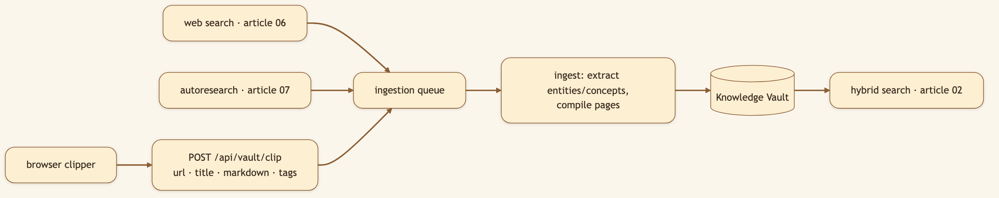

# What If Your Research System Learned From Both the Agent and You?

> **LinkedIn hook (use as the post's first line):** "The agent searches one part of the web. You read another. A useful knowledge system should learn from both, then investigate the gaps neither of you noticed."
> **Audience:** LinkedIn -> Medium. Researchers, PKM enthusiasts, analysts, and builders interested in continuous agentic research.

---

Research has two modes that rarely meet.

There is **intentional research**: you formulate a question, search, evaluate sources, and write a conclusion.

Then there is **ambient learning**: an article appears in a newsletter, a colleague sends a link, or you find a useful paper while investigating something else.

Most AI systems capture the first only during a chat. Most bookmarking systems capture the second as an inert list of URLs. CapyHome connects both to the same Knowledge Vault, then adds an **Autoresearch Loop** that can investigate the remaining gaps.

The result is a living evidence base fed by three kinds of curiosity:

1. Questions you explicitly ask.
2. Pages you actually read.
3. Follow-up questions the system identifies.

## The browser clipper makes human attention a signal

A bookmark says, "I may want this later." A clip says, "Preserve the useful content now."

CapyHome's browser extension can capture an article, a selection, or a full page as markdown and queue it for vault ingestion. Auto-clip mode uses dwell time, content length, a blocklist, and deduplication so opening a page is not automatically treated as endorsement.

This design reflects a subtle point: your attention is valuable metadata.

If you spend time reading a source, it may deserve a place beside agent-discovered evidence. The source can then contribute to entity and concept pages, appear in later vault searches, and influence the questions Autoresearch considers already answered.

## Autoresearch makes unanswered questions durable

Deep research rarely ends because every possible question has been answered. It ends because the deadline arrives, the report is sufficient, or the next question is not obvious.

The Autoresearch Loop turns open questions into a persistent program:

1. Generate questions across a broad taxonomy.
2. Compare them with the question ledger and existing vault.
3. Skip duplicates and already-covered questions.
4. Dispatch focused research subagents.
5. Save useful answers and sources into the vault.
6. Reflect on what the new evidence makes worth asking next.
7. Stop when novelty decays.

The ledger is crucial. Without it, an autonomous loop has no durable memory of what it asked, what failed, and what was redundant. It will eventually spend money rephrasing the same curiosity.

## Why every path ends in the vault

WebSearch, browser clips, and Autoresearch produce different kinds of input, but they share one destination.

That common destination lets the paths improve one another:

- A browser clip can prevent Autoresearch from repeating a question you already answered through reading.
- An agent search can add context around a clipped article.
- Autoresearch can identify missing evidence on an entity page created by an earlier project.
- A future task can retrieve all of it before searching the live web.

This is more powerful than three separate features. It is a feedback loop.

## A practical workflow

Choose a topic with long-term value, such as:

> The commercial adoption of humanoid robots in logistics and manufacturing.

Start with one Plan Mode research task to establish the landscape. Over the next week, let the browser clipper capture serious articles you read. Trigger Autoresearch on the key entity or concept pages so it can pursue unanswered questions about costs, safety, deployment numbers, and customer evidence.

At the end of the week, ask:

> Based on the vault, which claims about near-term humanoid robot adoption are supported by demonstrated deployments, and which rely mainly on vendor projections?

The answer now draws from deliberate research, human-selected reading, and systematic gap-filling.

## The benefit is not infinite research

"Always researching" sounds attractive until it becomes an uncontrolled loop that fills storage and produces low-value summaries.

CapyHome uses several brakes:

- deduplication before work begins;
- a bounded number of questions and parallel researchers per iteration;
- a ledger with explicit statuses;
- novelty decay as a stopping signal;
- vault linting and pruning;
- user controls for capture and ingestion.

The aim is not maximum activity. It is a better ratio of new evidence to repeated effort.

## The deeper impact: a research relationship over time

A one-shot agent can be impressive. A system that learns the contours of your interests can become useful in a different way.

It begins to know which entities recur, which concepts connect your projects, which questions remain open, and which sources you considered worth reading. Not because it inferred a vague personality profile, but because the evidence and research state remain inspectable on disk.

That creates continuity without requiring blind trust. You can open the vault pages, inspect the ledger, disable auto-clip, prune weak material, and decide which topic deserves another loop.

## Video script (45-60 seconds, vertical Short)

> **[0:00-0:06] Hook:** "My agent researches. I read. Why should those become two separate libraries?"
>
> **[0:06-0:17] Browser clip:** Read an article, trigger the extension, and show "Queued for ingestion."
>
> **[0:17-0:29] One vault:** Open the resulting concept page beside sources captured by WebSearch.
>
> **[0:29-0:44] Autoresearch:** Start a topic and flash through the question ledger, parallel researchers, and a duplicate being skipped.
>
> **[0:44-0:54] Synthesis:** Ask a new question and show the answer drawing from search, clips, and Autoresearch.
>
> **[0:54-0:60] Close:** "One evidence base, learning from both the agent and you."

---

*Next: [Subagents, Slash Commands, and Mounted Folders ->](./18-subagents-slash-commands-mounted-files.md).*
