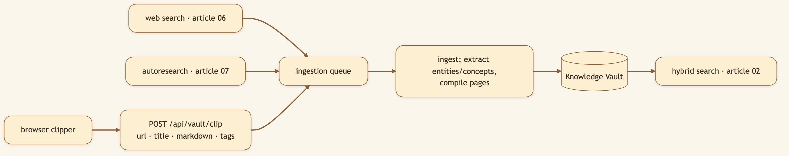
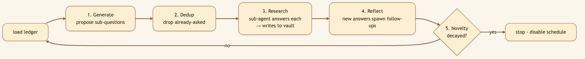

# What If Your Research System Learned From Both the Agent and You?

> **LinkedIn hook (use as the post's first line):** "The agent searches one part of the web. You read another. A useful knowledge system should learn from both, then investigate the gaps neither of you noticed."
> **Audience:** LinkedIn -> Medium. Researchers, PKM enthusiasts, analysts, and builders interested in continuous agentic research.

---

You ask an agent to research humanoid robots in logistics. It searches five articles, extracts findings, and stores them.

Three days later, you read a blog post about a real deployment at a warehouse in Germany. It's valuable, so you bookmark it. That bookmark sits in a folder. It never talks to the agent's research.

Meanwhile, both of you missed something: how does the Tesla roadmap for humanoid robots affect the supply chain economics? Neither your reading nor the agent's search happened to bump into that angle.

**This is the gap:** agent research, human reading, and systematic investigation all happen in silos.

CapyHome connects all three to one Knowledge Vault, then adds an **Autoresearch Loop** that fills the gaps you both missed.

The result is a living evidence base fed by three kinds of curiosity:

1. Questions you explicitly ask (agent-driven research)
2. Articles you actually read (human attention)
3. Follow-up questions the system identifies (systematic gap-filling)

## The browser clipper turns your reading into research infrastructure

A bookmark says, "I may want this later." A clip says, "This is research. Treat it like everything else."

CapyHome's browser extension captures an article, selection, or full page as markdown and queues it for vault ingestion. Auto-clip mode (optional) uses dwell time, content length, and deduplication—so reading an article for two minutes is treated differently than opening it for five seconds.

Here is what happens next:

- The article becomes markdown in the vault
- It contributes to entity pages (if it mentions Tesla, the Tesla page strengthens)
- It contributes to concept pages (if it discusses supply-chain risk, that concept page grows)
- It influences future searches (vault retrieval now includes your human-selected evidence)
- It signals to Autoresearch: "This question was already answered by human reading"

**Your attention becomes metadata that improves the entire system.** Not because the system inferred some vague "interest profile," but because the evidence you chose to read is now alongside evidence the agent discovered. They inform each other.

## Autoresearch turns open questions into durable investigation

Deep research doesn't end because everything is answered. It ends because the deadline hits, the report is good enough, or the next question isn't obvious.

Autoresearch keeps the loop alive. One iteration:

**1. Generate questions**
Across a broad taxonomy—cost, deployment evidence, safety claims, competitive impact, customer concentration, timeline risk. Twenty candidate questions.

**2. Deduplicate** (the ledger is crucial)
Did we ask "deployment numbers in logistics" last week? Skip it. Did human reading already cover "cost per unit"? Skip it. The question ledger remembers what you know and what you've tried.

**3. Dispatch research subagents**
Five parallel researchers pursue the best unanswered questions.

**4. Ingest and reflect**
Useful answers land in the vault. Each answer updates entity and concept pages. The system then asks: "What does this new evidence make worth investigating?"

**5. Stop when novelty decays**
New questions yield diminishing returns. The loop stops naturally.

Without the ledger, an autonomous loop has amnesia. It rephrases the same curiosity and burns tokens. With the ledger, it remembers what it discovered, what it tried and failed, and what human reading already covered. It moves forward, not in circles.

## One vault = three inputs informing each other

WebSearch, browser clips, and Autoresearch produce different kinds of signal. All end up in one place.

**WebSearch finds:** "Tesla's humanoid roadmap targets 2026 mass production."
→ Lands in vault as Tesla entity page update and supply-chain-timeline concept page.

**Browser clip captures:** A detailed blog post from a logistics CTO about real deployment challenges.
→ Also lands in vault, enriching supply-chain-risk and customer-evidence concept pages.

**Autoresearch notices:** "We have plenty of cost estimates but no evidence of what customers actually paid."
→ Launches targeted research. Results land in the same vault, on the same concept pages.

**One month later, a new question arrives:** "Has any customer publicly discussed ROI from humanoid robot deployment?"
→ Vault retrieval now synthesizes from WebSearch *and* your blog clip *and* Autoresearch results. One coherent answer.

This is not three separate features. It is a feedback loop. Each path makes the others smarter.

## A practical workflow: one week, three inputs converging

**Topic:** The commercial adoption of humanoid robots in logistics and manufacturing.

**Monday morning:** Run a Plan Mode research task. "Map the landscape: key vendors, customer base, deployment timelines, cost models." Agent researches for two hours, ingests eight sources.

**Monday–Friday:** As you read the industry news and follow-ups, clip three articles that resonate—a Tesla blog post, a warehouse operator's case study, a financial analyst report. Each clip lands in the vault under entities (Tesla, customer X) and concepts (deployment risks, customer concentration).

**Wednesday evening:** Trigger Autoresearch on the "customer evidence" concept page. The system notices: "We have plenty of vendor timelines but no data on what actual customers report." It dispatches three subagents to search for public case studies, earnings call transcripts, and reddit discussions. Results ingest overnight.

**Friday morning:** Ask the synthesis question:

> Based on our vault, which claims about near-term humanoid robot adoption are backed by demonstrated deployments, and which are mostly vendor projections?

The answer draws from:
- Your deliberate Monday research
- Your three human-selected reads
- Three days of systematic gap-filling

One question, one vault, three sources of truth converging.

## Intelligent brakes prevent infinite activity spirals

"Always researching" sounds great until it becomes a runaway loop—endless questions, low-value answers, storage bloat, token waste.

CapyHome prevents that with layered brakes:

**Before work begins:**
- Deduplication: Don't ask a question you already asked
- Ledger matching: Skip questions answered by prior searches or human reading

**During work:**
- Bounded questions per iteration (e.g., 10 candidate questions, pick 5)
- Bounded parallelism (5 subagents max, not unlimited)

**After work:**
- Novelty detection: "This iteration answered 3 new questions. Last iteration answered 12. Stop."
- Vault linting: Remove thin sources, duplicates, and noise
- User controls: Kill the loop, disable auto-clip, or prune manually

**The principle:** The goal is not maximum activity. It is a better ratio of *new evidence per token spent*. Stop researching when returns diminish.

## The deeper impact: research becomes a long-term practice

A one-shot agent is impressive. A system that *compounds knowledge over months* becomes foundational.

Over time, the vault begins to know:
- Which entities recur in your work (Tesla, Amazon, certain competitors)
- Which concepts connect your projects (supply chain risk, customer concentration, margin pressure)
- Which questions remain genuinely open
- Which sources *you* considered worth reading (human curation signal)

Not because the system inferred some vague personality profile. But because *the evidence remains inspectable on disk.* You can open entity pages, read the ledger, see what Autoresearch tried and failed, prune weak material, and decide which topics deserve another investigation loop.

Continuity without blind trust. The system learns from you because you can *see* what it learned, verify it, and course-correct.

## Video script (45-60 seconds, vertical Short)

> **[0:00-0:06] Hook:** "My agent researches. I read. Why should those become two separate libraries?"
>
> **[0:06-0:17] Browser clip:** Read an article, trigger the extension, and show "Queued for ingestion."
>
> **[0:17-0:29] One vault:** Open the resulting concept page beside sources captured by WebSearch.
>
> **[0:29-0:44] Autoresearch:** Start a topic and flash through the question ledger, parallel researchers, and a duplicate being skipped.
>
> **[0:44-0:54] Synthesis:** Ask a new question and show the answer drawing from search, clips, and Autoresearch.
>
> **[0:54-0:60] Close:** "One evidence base, learning from both the agent and you."

---

*Next: [Subagents, Slash Commands, and Mounted Folders ->](./18-subagents-slash-commands-mounted-files.md).*
