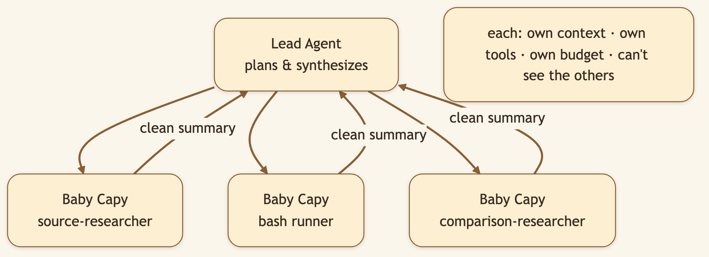
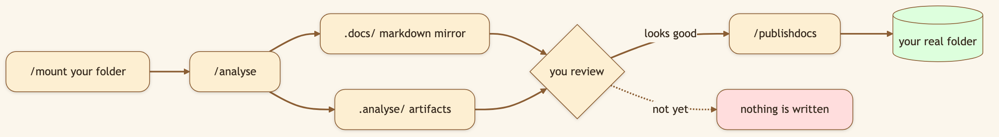

# Parallel Agents Become Useful When They Can Work on Your Real Files

> **LinkedIn hook (use as the post's first line):** "Parallel AI agents are a demo until they can inspect the same project, divide the work cleanly, and return something you can actually use."
> **Audience:** LinkedIn -> Medium. Developers, consultants, researchers, and knowledge workers whose real work lives in local folders.

---

You ask three agents to audit an unfamiliar codebase in parallel.

Agent A generates a summary of its own view of `README.md`. Agent B summarizes a different view of the same `README.md`. Agent C writes a third summary. You get three different descriptions of one file, zero division of labor, and a context window full of duplicated effort.

Parallelism feels fast until it hits reality: **agents can't coordinate without shared context, and they can't inspect shared context without seeing the actual files.**

The hard problems are not "agents writing text faster." They are:

- How does each worker get a clear, non-overlapping assignment?
- How do independent tasks run in parallel, and dependent tasks wait?
- How does the lead receive a *summary* instead of three transcripts?
- How do agents access the files they actually need?
- How are writes bounded—reviewed before they change the real project?

CapyHome solves this with **Baby Capy subagents**, **slash commands**, and a mounted sandbox path.

## One lead, several focused workers

The lead agent decomposes the task and launches up to three subagents in parallel. Each receives a narrow assignment, its own context window, tools, timeout, and budget.



**Context isolation is not a scaling trick—it protects reasoning.**

One giant agent that reads every file, every search result, every failed tool call becomes bloated. Its reasoning dilutes. Focused workers inspect a thin slice *deeply*, return a concise summary. The lead keeps space to compare and judge.

Real example—auditing an inherited codebase:

- **Baby Capy 1** inspects architecture: directory structure, module boundaries, dependency graphs. Returns: architecture summary.
- **Baby Capy 2** traces data flow: request ingress → response egress, state mutations, IO patterns. Returns: flow diagram and concerns.
- **Baby Capy 3** audits tests and ops: coverage, failure modes, deployment risk. Returns: risk assessment and gaps.
- **Lead** reads three summaries (not three transcripts), weighs contradictions, synthesizes the due-diligence report.

Total time: parallel. Total effort: divided. Final artifact: trustworthy because it's assembled from focused investigation, not from one exhausted agent drowning in files.

## `/mount` connects the sandbox to real work

Type `/mount`, choose a folder from your machine, and CapyHome mounts it inside the agent environment:

```text
/mnt/user-data/mounted
```

Now agents can:
- Read your actual code, config, tests, docs—not abstractions or summaries
- Trace real imports and dependencies, see how modules actually connect
- Inspect naming conventions, commit history, file organization
- Understand *why* the codebase is structured the way it is

This beats uploading files one by one. **Folder structure is evidence.** How modules are organized tells you about team structure, architectural assumptions, and code maturity.

> **[Generate: Split-panel illustration using the character from `asset/CapyHome/capybara-logo.webp` as the base. Left panel: a cute cartoon capybara clicks on a native macOS-style folder picker dialog — a folder named "my-project/" is highlighted in blue, with an "Open" button in the bottom-right corner. Right panel: the same capybara's illustrated laptop screen shows a CapyHome sidebar file tree with a pinned node at the top labelled "/mnt/user-data/mounted" with a 📌 pin icon, expanding to show two child folders. Warm cream background, fully illustrated.]**

## Slash commands make the safety contract memorable

The workflow unfolds in explicit stages:

```text
/mount         Select the local folder (now visible at /mnt/user-data/mounted)
/analyse       Build markdown mirrors and analysis artifacts (read-only)
/publishdocs   Write reviewed documentation back to mounted folder
/handoff       Package context and continue in a fresh thread
/compact       Reduce context deterministically (useful for long sessions)
/new           Start a fresh conversation in the workspace
```

`/analyse` is deliberately read-only. It generates artifacts—repository overviews, architecture diagrams, risk summaries—that you can inspect and revise before anything touches the real files.



**The goal is not to forbid writes.** It's to make write-back explicit and reversible. You see what will change before it changes. You approve before it lands. The mounted folder is not a black box—it's a staging area under your control.

## An end-to-end example: Technical due diligence in 90 minutes

You inherit a 50K-line codebase. You need a due-diligence report by tomorrow.

1. Run `/mount` and select the repository root.
2. Run `/analyse` to generate a markdown mirror of the codebase structure and a repository overview.
3. Review the overview. It's accurate—agents read the actual code.
4. Enter Plan Mode. Ask: "Assess architecture, security boundaries, test coverage, deployment risk, and maintainability. Return a due-diligence report with findings and references."
5. Approve the todo graph: the plan breaks the assessment into parallel work streams.
6. **Parallel phase** (20 minutes):
   - Baby Capy 1 audits architecture and security boundaries.
   - Baby Capy 2 traces data flow and operational risk.
   - Baby Capy 3 examines test coverage and maintainability.
7. Lead agent synthesizes three focused summaries into one coherent report, citing file paths and line numbers.
8. Review the report. If revisions needed, the lead agent can revise specific sections without re-running parallel work.
9. Run `/publishdocs` to write the report back to a `due-diligence.md` in the mounted folder.

This is where parallelism stops being theatre. Three focused workers, operating over one shared codebase, with distinct assignments and an explicit publish boundary you control.

## Why summaries flow back instead of transcripts

Transcripts feel transparent. They're also useless.

A lead agent drowning in three transcripts (each 5K tokens of thinking, tool calls, false starts, corrections) cannot synthesize. It can barely *read* them within a reasonable budget. Instead, each Baby Capy returns a structured summary:

```
## What I examined
- src/api/handlers/* (request routing)
- tests/integration/api_test.py (coverage report)
- docs/architecture.md (stated design)

## What I concluded
- Strong type safety via Pydantic validates 87% of inputs at boundary
- Test coverage at 73% with gaps in error-handling paths
- Three timeout risk points in database query layers

## Uncertainty
- No observed load test results; unclear if concurrency limits will hold under stress
- Legacy middleware layer (auth.py) lacks recent review

## Files to review
- src/api/handlers/users.py:156-184 (connection pooling risk)
- tests/error_cases_test.py (gaps identified)
```

Concise. Actionable. The lead scans three summaries (1K tokens total), spots contradictions, synthesizes a coherent view, and makes decisions. The activity timeline shows which tools each worker used—transparency preserved, usability restored.

## Why cap parallelism at three

Ten agents are not automatically faster than three.

Every additional worker:
- Consumes model quota (tokens, rate limits)
- Multiplies search concurrency (API throttling risk)
- Duplicates effort (all reading the same `README.md`)
- Consumes local memory (Docker, browser, GPU contention)

**Three focused workers beat ten diluted ones.** The limit forces meaningful decomposition. You must ask: "What is *truly* independent here?" instead of just parallelizing everything.

The todo dependency graph supplies the rest: run ready tasks in parallel, then synthesize after prerequisites complete. Wait for architecture assessment before evaluating security implications. That's not serial overhead—that's correct work.

## The impact: from answer generator to collaborative inspector

Mounting your real files transforms the agent. It stops being a detached text producer and becomes a tool that *understands* the materials already on your desk.

Subagents make that understanding parallel without forcing one context window to carry everything. Slash commands make the workflow legible: mount, analyze, review, publish. The sandbox keeps your control visible.

The result is a clear division of labor:

- **You** choose the folder and state the goal
- **Planner** decomposes into independent work streams
- **Baby Capys** investigate in parallel—architecture, data flow, tests, ops—each with a narrow scope
- **Lead** reads three summaries (not three transcripts), synthesizes findings, produces a report
- **You** decide when results land in the real folder

You are never a passenger. The agents are never flying blind.

## Video script (45-60 seconds, vertical Short)

> **[0:00-0:06] Hook:** "Multiple agents writing paragraphs is not teamwork. Give them a real project."
>
> **[0:06-0:17] Mount:** Type `/mount`, choose a repository, and show it appearing at `/mnt/user-data/mounted`.
>
> **[0:17-0:29] Analyse:** Run `/analyse` and open the generated repository overview. Caption: "Read-only staging."
>
> **[0:29-0:45] Parallel work:** Submit a due-diligence task and show three Baby Capys inspecting architecture, security, and tests simultaneously.
>
> **[0:45-0:54] Control:** Open the final report, then run `/publishdocs` to write back deliberately.
>
> **[0:54-0:60] Close:** "Real files, parallel research, and you control when anything changes."

---

*Back to the [series index](./00-index.md).*
