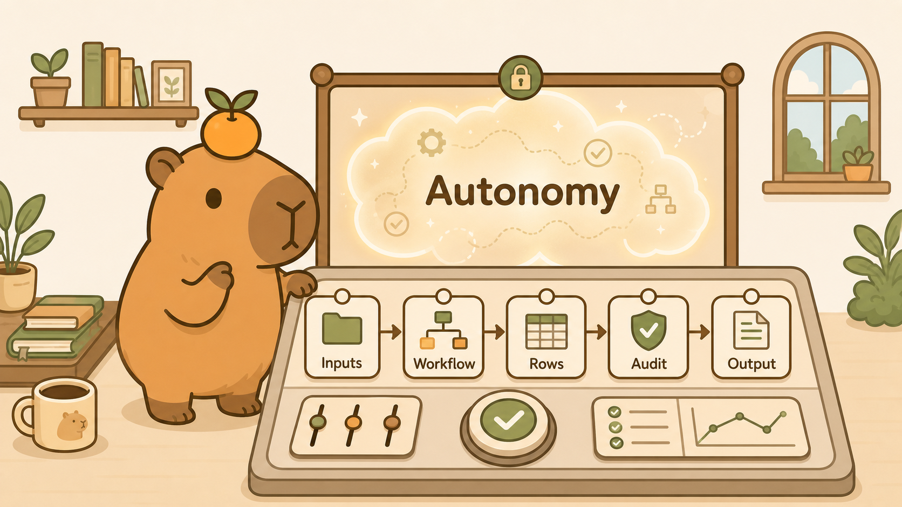
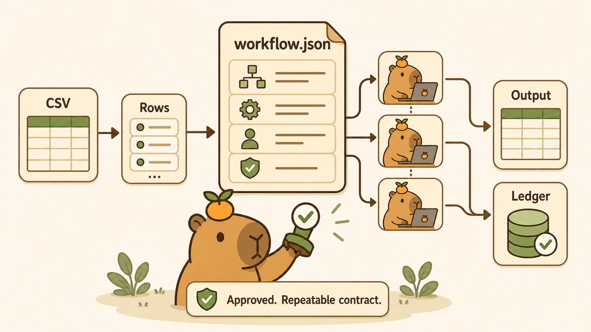
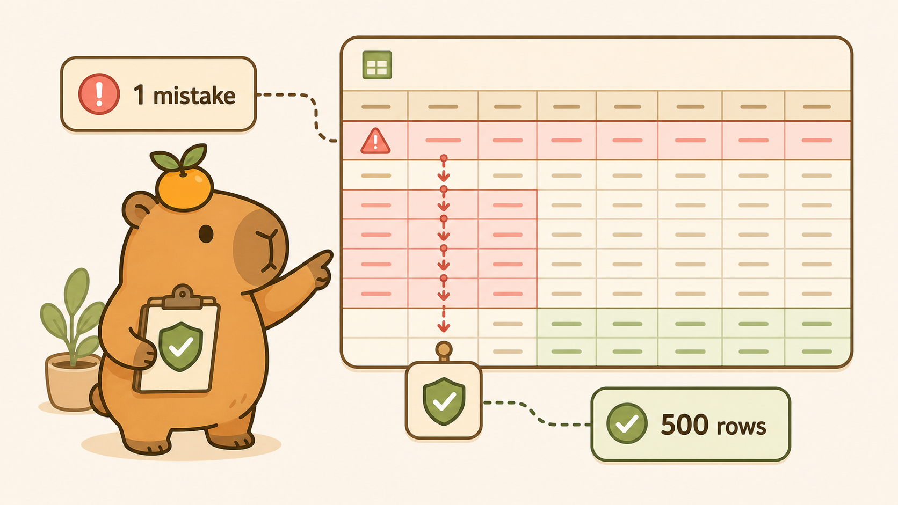
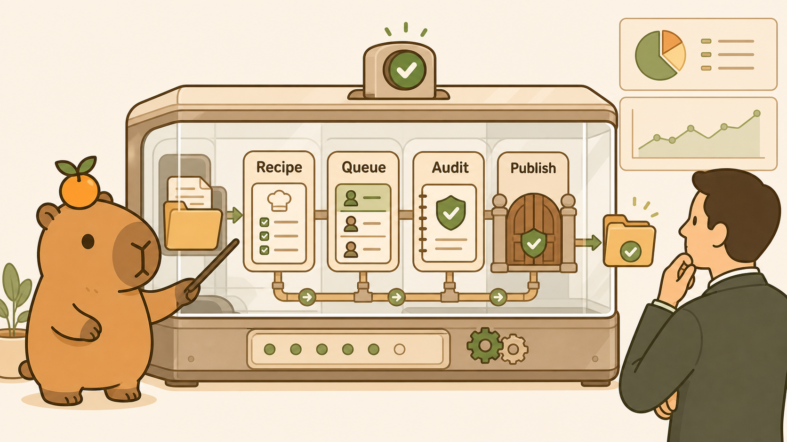

# One Wrong Assumption Should Not Become 500

> **LinkedIn hook (use as the post's first line):** "The danger in a long-running AI workflow is not one bad answer. It is one bad answer becoming context for the next 499."
> **Audience:** LinkedIn -> Medium. Agent builders, operations teams, AI transformation leaders, and anyone trying to move an agent from one-off answers into repeatable work.

---

An AI agent can make one mistake in a conversation and cost you a few minutes.

Put that same agent in charge of a 500-row spreadsheet and the failure mode changes. A wrong assumption made on row 3 can become implicit context for row 4. The agent can reuse the same flawed interpretation on row 5, reinforce it on row 6, and carry it through the rest of the file.

By the time anyone notices, the problem is no longer one incorrect answer.

It is a batch process that confidently reproduced the mistake.

This is the part of long-running agent design that interests me most. The difficult question is not only:

**Can the agent keep working?**

It is:

**Can each unit of work stay bounded, inspectable, and recoverable while the overall job keeps moving?**

That question led me to build `/workflow` in CapyHome.

The core idea is simple: **share the approved workflow, not the accumulated conversation.** Every row gets a fresh Work Mode thread. A parent-owned SQLite ledger remembers durable progress. The child agent receives one row, one instruction, and one output contract. When it finishes, the child returns JSON and the parent decides what becomes part of the final CSV.



## Why one long conversation is the wrong abstraction for batch work

Long context is useful when a conversation needs continuity. It is dangerous when continuity becomes accidental workflow state.

Imagine asking one agent to enrich 500 company records inside one continuous thread. The agent reads row 1, searches the web, explains what it found, and moves to row 2. Its context now contains the first row, the search process, the answer, and any shortcuts it took. After fifty rows, the model is not only following your instruction. It is also following a growing history of its own previous decisions.

Three problems appear.

### 1. A local mistake can become precedent

Suppose row 7 contains an ambiguous company name. The agent guesses the wrong legal entity. In a shared conversation, that guess can influence how it interprets similar names later. The model may treat its own earlier conclusion as evidence.

### 2. The instruction can drift

The first ten answers may follow the requested format. Later answers can gain explanations, citations, or slightly different field names because the model has spent thousands of tokens observing its own output rather than receiving the original contract cleanly.

### 3. Progress exists only inside the transcript

If the process stops at row 243, what is the source of truth? The chat history? A half-written CSV? The model's memory of where it stopped? None of those is a reliable work ledger.

The answer is not an even larger context window. The answer is to separate **durable process state** from **temporary reasoning context**.

## The design principle: shared contract, isolated attempts

CapyHome splits a workflow into four parts:

1. A reviewable `workflow.json` defines the contract.
2. SQLite stores the durable state of every row.
3. A fresh child Work Mode thread reasons about one row.
4. The parent workflow runner validates the response and materializes the output CSV.

The flow looks like this:

```text
CSV + user request
        |
        v
reviewable workflow.json
        |
        v
SQLite row ledger --claim--> fresh child thread per row
        ^                              |
        |                              v
        +------ validated JSON <-------+
        |
        v
atomic output CSV
```

This is an agent-level version of the **bulkhead pattern**: partition work so a failure in one unit does not automatically cascade into the others. The pattern is well established in reliability engineering; the unusual part here is that the resource being isolated is not only CPU, memory, or a connection pool. It is also the model's conversational context. [Microsoft's Bulkhead pattern documentation](https://learn.microsoft.com/en-us/azure/architecture/patterns/bulkhead) describes the same goal at the system level: constrain the blast radius of a malfunction.

The workflow still shares one instruction and one schema. What it does not share is the growing transcript of previous rows.



## `/workflow` begins with a contract, not execution

A workflow starts as a normal CapyHome request:

```text
@companies.csv /workflow
For each row, find the company's full headquarters address.
Return one line in a new `full_address` column.
```

The frontend does not immediately send the whole file into a batch loop. It converts the command into a planning prompt whose sole objective is to create:

```text
/mnt/user-data/workspace/runtime/workflow.json
```

The planning prompt tells the agent to inspect the CSV columns and sample rows, define the per-row instruction, define the expected output shape, resolve ambiguity, and **not process the full file yet**.

That pause matters. The most dangerous error in a batch workflow is often not a row-level failure. It is a bad shared instruction that every row follows perfectly.

The resulting recipe is visible and editable before execution. A simplified version looks like this:

```json
{
  "version": "1",
  "source": {
    "path": "/mnt/user-data/workspace/uploads/companies.csv",
    "type": "csv"
  },
  "row_task": {
    "instruction": "Find the full headquarters address for this company.",
    "input_fields": ["company_name", "country"],
    "output_schema": {
      "full_address": "string"
    },
    "failure_value": "failed run",
    "no_result_value": ""
  },
  "execution": {
    "status": "ready",
    "max_parallel": 1,
    "flush_every_completed_rows": 20,
    "add_to_memory": false,
    "compact_child_runs": true,
    "consecutive_failures_limit": 5
  }
}
```

The full file also records runtime paths, progress counters, failed rows, export cadence, model choice, and cleanup behavior. In the UI, the user can open it, edit it as JSON, save it, or execute the next row or batch. The recipe is therefore both machine-readable configuration and a human review boundary.

The implementation lives in the frontend's [`input-box.tsx`](https://github.com/yilongchua/CapyHome/blob/main/frontend/src/components/workspace/input-box.tsx) and [`WorkflowApprovalOverlay`](https://github.com/yilongchua/CapyHome/blob/main/frontend/src/components/workspace/plan-approval-overlay.tsx).

## What happens after “Execute Workflow”

The execution engine is intentionally less magical than the UI. Most of it lives in [`backend/src/gateway/routers/workflow.py`](https://github.com/yilongchua/CapyHome/blob/main/backend/src/gateway/routers/workflow.py), which manages the recipe, row state, child runs, validation, recovery, and CSV export.

### 1. Prepare a durable row ledger

The backend checks the CSV path, reads its columns, and imports every row into SQLite. Each row moves through a small set of states: `pending`, `running`, `success`, or `failed`. A cancelled row returns to `pending` so it can be retried.

This gives each part of the system a clear job:

- `workflow.json` is the editable contract.
- SQLite is the live source of truth for row state and results.
- The output CSV is the materialized deliverable, not the work queue.

Yes, the least glamorous part of the AI agent is a database table. The database is coping well.

### 2. Claim a row before asking an agent to think

The runner takes up to `max_parallel` pending rows and marks them `running` before starting any child agent. The claim happens inside a SQLite `BEGIN IMMEDIATE` transaction, with write-ahead logging and a busy timeout, so two requests on the same host do not casually pick up the same row.

The details are covered in the official [SQLite transaction documentation](https://www.sqlite.org/lang_transaction.html) and [WAL documentation](https://www.sqlite.org/wal.html). The important idea is simpler: **record ownership first, then do the expensive work.**

This is a practical local-first mechanism, not a distributed job queue.

### 3. Run one fresh child thread per row

For every claimed row, CapyHome creates a new Work Mode thread. Its prompt contains only the shared instruction, that source row, the expected JSON shape, and the rules for failure or no result.

```text
Instruction: Find the full headquarters address.
Row: { ...one source row... }
Return: { "full_address": "string" }
On tool failure: { "full_address": "failed run" }
Do not write files. Return JSON only.
```

The child assigned row 243 never sees the transcript from rows 1 through 242. It cannot inherit their conclusions, guesses, or increasingly confident nonsense. That is the main idea shown in the video: **every row runs in a fresh context, so there is no row-to-row transcript spillover.**

The child gets one row and one job. A level of focus many meetings have yet to achieve.

“Fresh context” is a conversational boundary, not a separate machine, container, model deployment, or security boundary. Child runs still use CapyHome's normal Work Agent and tool environment. By default, `add_to_memory` is `false`, so they do not write row outcomes into long-term user memory.

### 4. Validate, record, and export

The child cannot write directly to SQLite or the CSV. It returns text to the parent, which removes an optional Markdown fence, parses the JSON, requires an object with the expected fields, and recognises the configured failure value.

For example, `{"full_address": "1 Raffles Place, Singapore 048616"}` is accepted. Invalid JSON, a missing field, or `{"full_address": "failed run"}` is recorded as a failure. An empty string currently means the run succeeded but found no result.

This is structural validation, not fact-checking or full JSON Schema enforcement. A plausible but incorrect address can still pass, which is why high-risk workflows need domain-specific checks.

The parent stores the outcome, child identifiers, timestamps, and error details in SQLite. It then merges the source and result data into an output CSV. Export uses a temporary file followed by an atomic replacement, avoiding a half-written deliverable if the process stops midway.

Results are flushed according to `flush_every_completed_rows`, and also when a run stops or finishes. Successful child threads are cleaned up; failed ones stay available for debugging unless `flush_all` is enabled.



## Failure containment is not the same as correctness

This distinction is essential.

Row isolation prevents one child's conversation from teaching the next child a bad habit. It contains invalid JSON, tool errors, and row-specific ambiguity to the affected row.

It does **not** make a bad shared instruction safe.

If `workflow.json` says “use the first search result without verification,” every fresh child can independently follow that bad rule. Isolation removes accidental cross-row memory; it does not remove the shared contract.

It also cannot detect every plausible hallucination. A child can return valid JSON with the required field and still be factually wrong.

That is why workflow safety needs two layers:

1. **Review the shared pattern before scale.** Inspect the instruction, output shape, failure behavior, and source columns.
2. **Contain each execution attempt.** Give each row a fresh context, validate its response, and record the outcome separately.

For higher-risk work, I would start with `max_parallel: 1`, review a sample of outputs, then increase concurrency only after the contract behaves as intended. A future version should support explicit sample approval and domain-specific validators before hundreds of rows are released.

## A bad dependency should stop the run, not create a retry storm

Some failures are local. Others reveal that the shared environment is unhealthy.

If one company has no public address, the row can return an empty result and the workflow can continue. If web search times out five rows in a row, continuing to launch hundreds of identical attempts is wasteful.

CapyHome tracks `consecutive_failures` and stops at `consecutive_failures_limit`, which defaults to five. The workflow status becomes `stopped_failed_threshold`, and the failed row numbers remain visible.

This is a small circuit-breaker-like control. It does not diagnose the root cause, but it stops obvious systemic failure from becoming an expensive queue of doomed work.

## Stop and recover are part of the workflow, not edge cases

A long-running process needs a useful answer to “what happens if I interrupt it?”

When the user presses Stop, the backend:

- marks the active workflow as stop requested;
- attempts to cancel known child LangGraph runs;
- returns `running` rows to `pending`;
- marks the workflow as `stopped`; and
- exports the partial CSV if the ledger exists.

The work already recorded as successful remains durable.

The `/workflow-recover` command provides the recovery path. It requeues `failed` and `running` rows, clears their previous child identifiers and errors, resets the failure counters, and returns the workflow to `ready`. Successful rows stay complete.

This is closer to how an operations process behaves than how a chat behaves. Stopping does not mean forgetting. Recovery does not mean starting over.

## Manual execution and Auto Mode use the same contract

In manual mode, one press of **Execute Workflow** processes the next row or the next batch, depending on `max_parallel`.

The backend endpoint is deliberately blocking: it returns after the claimed children have completed, failed, or been cancelled. That keeps one execution call easy to reason about.

When Auto Mode is enabled, the frontend waits for that response and schedules the next `execute-next` call while work remains. Auto Mode does not give child agents a looser prompt, broader write access, or shared row memory. It changes the repetition policy around the same approved contract.

That is a useful way to think about autonomy:

**Auto Mode decides whether the next approved batch starts automatically. `workflow.json` still decides what every row is allowed to do.**

## The controls that matter in practice

The execution object exposes several levers:

| Field | What it controls | Why it matters |
|---|---|---|
| `max_parallel` | Number of pending rows claimed in one batch | Trades throughput against model/tool capacity and cost. |
| `flush_every_completed_rows` | How often processed results are materialized and successful children are cleaned up | Balances frequent durable output against write and cleanup overhead. |
| `flush_all` | Whether failed child threads are also deleted during cleanup | Keep failures for debugging by default; remove them when row-level trace retention is unnecessary. |
| `add_to_memory` | Whether child runs may update long-term user memory | Defaults off to avoid hundreds of row results polluting personal memory. |
| `compact_child_runs` | Uses short titles such as `wf r34` and skips title-generation calls | Reduces noise and unnecessary model calls for disposable workers. |
| `model_display_name` | Selects the configured model used by row workers | Allows a workflow to use a local or cost-appropriate model independently of the main chat choice. |
| `consecutive_failures_limit` | Stops the workflow after repeated explicit failures | Limits the blast radius of a broken dependency or contract. |

CapyHome also exposes workflow status in the activity panel: processed rows, total rows, average time per run, estimated remaining time, next row, parallelism, failures, and consecutive failures. The frontend refreshes this status while the workflow is active.

The relevant UI is in [`chat-activity-panel.tsx`](https://github.com/yilongchua/CapyHome/blob/main/frontend/src/components/workspace/chats/chat-activity-panel.tsx), and the runtime behavior is covered by [`test_workflow_router.py`](https://github.com/yilongchua/CapyHome/blob/main/backend/tests/test_workflow_router.py).

## What is still deliberately imperfect

This is an open-source implementation built in public, so the boundaries should be visible too:

- **It is local, not distributed.** SQLite and blocking gateway requests suit a local-first application, but active cancellation state currently lives in process memory. Stop is not yet robust across multiple gateway workers or a gateway restart; a distributed version needs persistent leases and child-run ownership.
- **Source replacement needs stronger detection.** Replacing the CSV after initialization does not automatically rebuild an existing ledger. A hardened version should fingerprint the source and ask before reinitializing it.
- **Validation checks shape, not truth.** The current gate catches invalid JSON, missing fields, and explicit failure values. It does not enforce every type, cross-field rule, or factual claim. An address workflow might require a country match and evidence URL; invoice extraction might verify that line items sum to the total.
- **Progress language can be clearer.** `completed_rows` currently counts successful rows, while the UI adds failed rows to show processed progress. Success, failure, processed, and pending should become separate first-class counters.
- **Some recipe fields remain declarative.** `input_fields` describes the intended inputs, but the child currently receives the complete source row. The empty-string no-result convention is also more tightly wired into the prompt than its configuration suggests. Both behaviors should become fully schema-driven.

These are not arguments against the design. They are the next engineering steps exposed by having a visible contract and ledger in the first place.

## The larger lesson: agents need smaller memories and better state

The instinct in AI product design is often to give the model more memory.

For batch work, I increasingly think the better design is selective memory:

- The workflow runner remembers the contract.
- SQLite remembers durable row state.
- The output remembers validated results.
- Each child remembers only enough to complete one row.
- Long-term personal memory stays off unless the user explicitly opts in.

This does not make the model smarter. It makes the system easier to reason about.

The final answer is no longer the only artifact. The recipe, row ledger, failure list, timing data, and partial output all become part of the product.

That is what turns an agent from a long conversation into a controlled workflow runner.



The agent can still browse, reason, use tools, and work in parallel. But it does so inside a smaller context and a clearer contract.

One row can fail.

The failure is recorded.

The next row starts fresh.

That is not less autonomy. It is autonomy with a boundary.

## Try it

Attach a CSV and use a request such as:

```text
@companies.csv /workflow
For each row, research the official company website and headquarters address.
Return `official_url`, `full_address`, and `evidence_url` as JSON fields.
```

Then:

1. Review `workflow.json` before execution.
2. Start with `max_parallel: 1`.
3. Inspect the first few outputs and failed child runs.
4. Increase parallelism only after the shared instruction is stable.
5. Use Stop without losing completed rows.
6. Use `/workflow-recover` to requeue failures after correcting the contract or dependency.

```bash
git clone https://github.com/yilongchua/CapyHome.git
cd CapyHome
make config
make dev
```

## Video reference and script (40 seconds)

Source clip: [`CapyHome_Workflow.mov`](./asset/CapyHome_Workflow.mov)

> **[0:00-0:05] Control room:** Introduce the workflow problem. Caption: “Work memory can carry mistakes forward.”
>
> **[0:05-0:11] Spreadsheet memory:** Show one ambiguous assumption entering the working context.
>
> **[0:11-0:18] Cascade:** “One wrong assumption becomes 500 wrong rows.”
>
> **[0:18-0:25] Isolated workers:** “CapyHome gives every row its own Work Mode thread.”
>
> **[0:25-0:31] Fresh context:** “Same approved instruction. Completely fresh conversational context.”
>
> **[0:31-0:36] No spillover:** “One row cannot teach the next row its mistake.”
>
> **[0:36-0:40] Failure boundary:** “If a row fails, the ledger records it and the failure stops there.”

---

*Back to the [series index](./00-index.md).*
